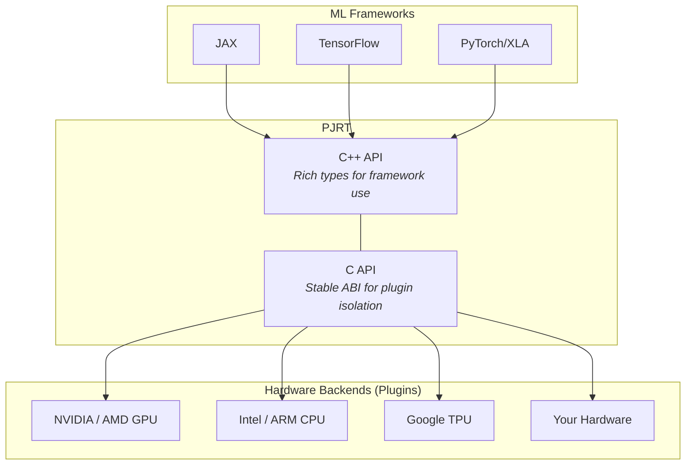

# PJRT: The Portable Runtime for ML Accelerators

PJRT (**P**retty much **J**ust another **R**un**T**ime) is XLA's uniform device
API. It is the standard interface between ML frameworks and hardware backends in
the OpenXLA ecosystem.

**The core idea is simple:** frameworks like JAX, TensorFlow, and PyTorch/XLA
don't talk to hardware directly. Instead, they talk to PJRT, and each hardware
vendor provides a PJRT plugin. This means a framework works on any accelerator
with a PJRT plugin, and a new accelerator works with any framework that uses
PJRT.

PJRT works alongside [StableHLO](https://openxla.org/stablehlo) -- a
hardware-independent intermediate representation for ML programs. Together,
StableHLO (the program format) and PJRT (the runtime interface) form a
toolchain-independent pair that can be used with any compiler, not just XLA.

## How It Works

### For Hardware Vendors (Plugin Authors)

A hardware vendor integrates with PJRT in three steps:

1. **Implement** the PJRT C API -- four core responsibilities:
   - **Compilation:** convert programs into device-executable code
   - **Execution:** run compiled executables with specified arguments
   - **Memory management:** handle data transfers between host and device
   - **Topology:** describe available devices and their configuration
2. **Package** the implementation as a shared library (`.so` / `.dylib`)
   exporting a `GetPjrtApi()` entry point
3. **Register** with frameworks -- either via `pip install` (automatic
   discovery) or by setting `PJRT_PLUGIN_LIBRARY_PATH`

Plugins are discovered automatically via Python package naming conventions
(`jax_plugins.<name>` or `jax-<name>` namespace packages), enabling zero-code-change
installation for end users.

### For Frameworks (Consumers)

Frameworks call PJRT through a small set of operations covering the full
lifecycle of running a computation on an accelerator:

1. **Discover devices** -- enumerate available hardware and their memory
2. **Compile programs** -- turn HLO/StableHLO into device-executable code
3. **Manage buffers** -- allocate device memory, transfer data to/from host
4. **Execute computations** -- run compiled programs on one or many devices
5. **Coordinate** -- handle multi-device and multi-host setups

These operations are exposed through two layers:

| Layer | File | Purpose |
|-------|------|---------|
| **C++ API** | `xla/pjrt/pjrt_client.h` | Rich, type-safe interface used by frameworks |
| **C API** | `xla/pjrt/c/pjrt_c_api.h` | Stable ABI boundary used by plugins |

The C API is the **plugin contract** -- hardware vendors implement it. The C++
API is the **framework interface** -- ML frameworks consume it. A bridging layer
(`PjRtCApiClient`) translates between the two.

### Versioning and Compatibility

The C API uses major/minor versioning with backward compatibility:
- Plugins compiled against an older version work with newer frameworks
- Frameworks detect plugin capabilities at runtime via `struct_size` fields
- No need for plugins to update in lockstep with framework releases

## Learning Path

Whether you're a framework developer, hardware vendor, or just curious, here's
a recommended order for learning about PJRT:

### Step 1: Understand the Concepts

Start with the high-level API surface -- the key classes and how they relate:

- [**C++ API Overview**](cpp_api_overview.md) -- `PjRtClient`, `PjRtDevice`,
  `PjRtBuffer`, `PjRtExecutable`, and how they work together. Includes a
  walkthrough of a real JAX session.

### Step 2: Understand the Architecture

Learn how PJRT is structured internally -- the two API layers, the plugin
system, and the class hierarchy:

- [**Architecture Deep Dive**](architecture.md) -- the C/C++ two-layer design,
  the `PJRT_Api` struct, the extension mechanism, plugin loading, and the
  full class inheritance tree.

### Step 3: Follow a Computation Through the System

Trace how a program goes from source to results:

- [**Compilation Pipeline**](compilation_pipeline.md) -- how HLO/StableHLO is
  compiled into device code (LLVM, PTX, etc.) through PJRT and XLA.
- [**Execution Pipeline**](execution_pipeline.md) -- the two-phase execute
  model, buffer donation, multi-device gang scheduling, and async futures.
- [**Buffer Management**](buffer_management.md) -- buffer lifecycle, memory
  allocation models, event-driven synchronization, and data transfers.

### Step 4: Explore a Specific Backend

Each backend document follows the same structure for easy comparison:

- [**GPU Backend (CUDA/ROCm)**](backend_gpu.md) -- memory allocators,
  stream management, multi-GPU topology, NCCL/RCCL collectives.
- [**CPU Backend (Intel/ARM)**](backend_cpu.md) -- thread pools, inline vs
  async execution, LLVM code generation.
- [**TPU Backend (Google)**](backend_tpu.md) -- the thin C API wrapper,
  HBM memory, what's known vs opaque.

### Step 5: Build or Integrate

Ready to write code?

- [**Integration Guide**](pjrt_integration.md) -- step-by-step instructions
  for implementing a PJRT plugin and testing it with JAX.
- [**C API Quick Reference**](c_api_reference.md) -- scannable lookup of all
  ~160 C API functions, organized by operation.
- [**Implementation Examples**](examples.md) -- real-world PJRT implementations
  (JAX CUDA plugin, GoMLX, ZML, Intel XLA, and more).

## Video Resources

- [**PJRT Plugin Tutorial**](https://www.youtube.com/watch?v=2GlMqaNxP_w)
  (OpenXLA 2024 Fall DevLab) -- hands-on walkthrough of plugin architecture and
  implementation
  ([slides](https://drive.google.com/file/d/1epUJkMONG2t06WOeMHz4Oi3F_-8cTuz-/view))
- [**XLA Overview**](https://www.youtube.com/watch?v=kAOanJczHA0) -- how XLA
  compiles and executes ML programs
- [**OpenXLA DevLab Playlist**](https://www.youtube.com/playlist?list=PLlFotmaRrOzv2OIEpijqiHGmY7rpscFcj)
  -- full set of DevLab recordings

## Ecosystem

PJRT is the default device runtime for Google's internal ML production workloads
across TPU, GPU, and CPU. It is the primary device interface for JAX and
TensorFlow, and is fully supported in PyTorch via PyTorch/XLA.

Hardware vendors using PJRT include:
- **Google** -- Cloud TPU
- **NVIDIA** -- GPU (CUDA)
- **AMD** -- GPU (ROCm)
- **Intel** -- GPU (via [Intel Extension for OpenXLA](https://github.com/intel/intel-extension-for-openxla))
- **Apple** -- Metal backend for Apple Silicon ([JAX on Metal](https://developer.apple.com/metal/jax/))

## Design Documents

- [PJRT Design Docs (Google Drive)](https://drive.google.com/drive/folders/18M944-QQPk1E34qRyIjkqDRDnpMa3miN)
- [PJRT Plugin Mechanism](https://docs.google.com/document/d/1Qdptisz1tUPGn1qFAVgCV2omnfjN01zoQPwKLdlizas/edit) -- plugin loading, discovery, client creation, and framework integration
- [PJRT Plugin RFC](https://github.com/openxla/community/blob/main/rfcs/20230123-pjrt-plugin.md) -- original community RFC adopting PJRT as the OpenXLA plugin mechanism
- [PJRT API/ABI Versioning and Compatibility](https://docs.google.com/document/d/1TKB5NyGtdzrpgw5mpyFjVAhJjpSNdF31T6pjPl_UT2o/edit)

## Key Source Files

| File | Description |
|------|-------------|
| [`xla/pjrt/pjrt_client.h`](../../xla/pjrt/pjrt_client.h) | C++ API: `PjRtClient`, `PjRtBuffer`, `PjRtLoadedExecutable` |
| [`xla/pjrt/c/pjrt_c_api.h`](../../xla/pjrt/c/pjrt_c_api.h) | C API: `PJRT_Api` struct with ~160 function pointers |
| [`xla/pjrt/c/CHANGELOG.md`](../../xla/pjrt/c/CHANGELOG.md) | C API version history |
| [`xla/pjrt/pjrt_compiler.h`](../../xla/pjrt/pjrt_compiler.h) | Compiler and topology interfaces |
| [`xla/pjrt/pjrt_executable.h`](../../xla/pjrt/pjrt_executable.h) | Executable interface and `CompileOptions` |
| [`xla/pjrt/pjrt_api.h`](../../xla/pjrt/pjrt_api.h) | Plugin registry (`LoadPjrtPlugin`, `SetPjrtApi`) |

## Community

- **Issues and feature requests:** [openxla/xla](https://github.com/openxla/xla/issues)
- **Questions:** [OpenXLA Discord](https://discord.gg/ZKXq7b3V8A)
- **Announcements:** [pjrt-announce mailing list](https://groups.google.com/g/pjrt-announce/)
- **External plugin reference:** [OpenXLA/IREE PJRT plugin](https://github.com/openxla/openxla-pjrt-plugin)
