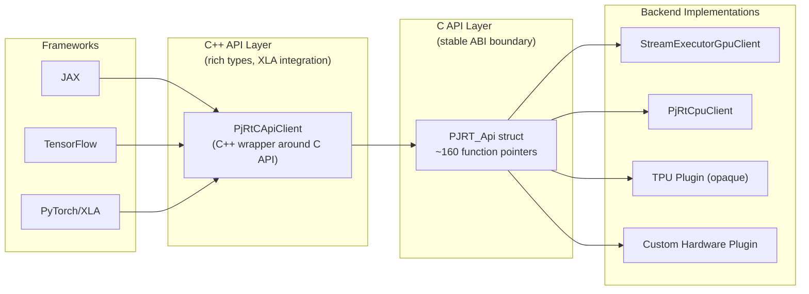
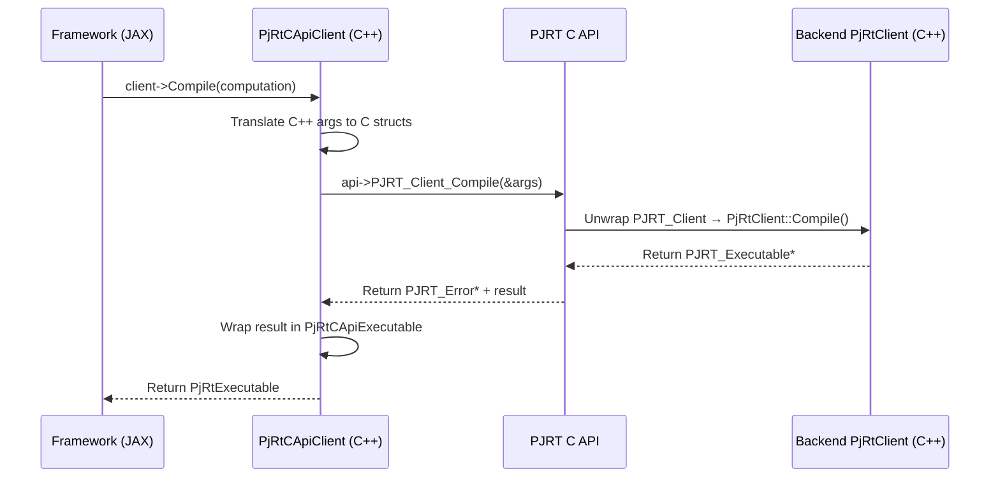
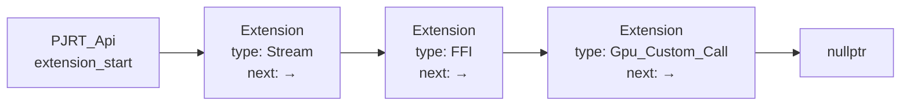
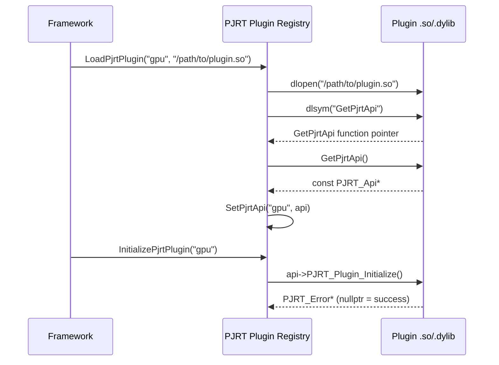
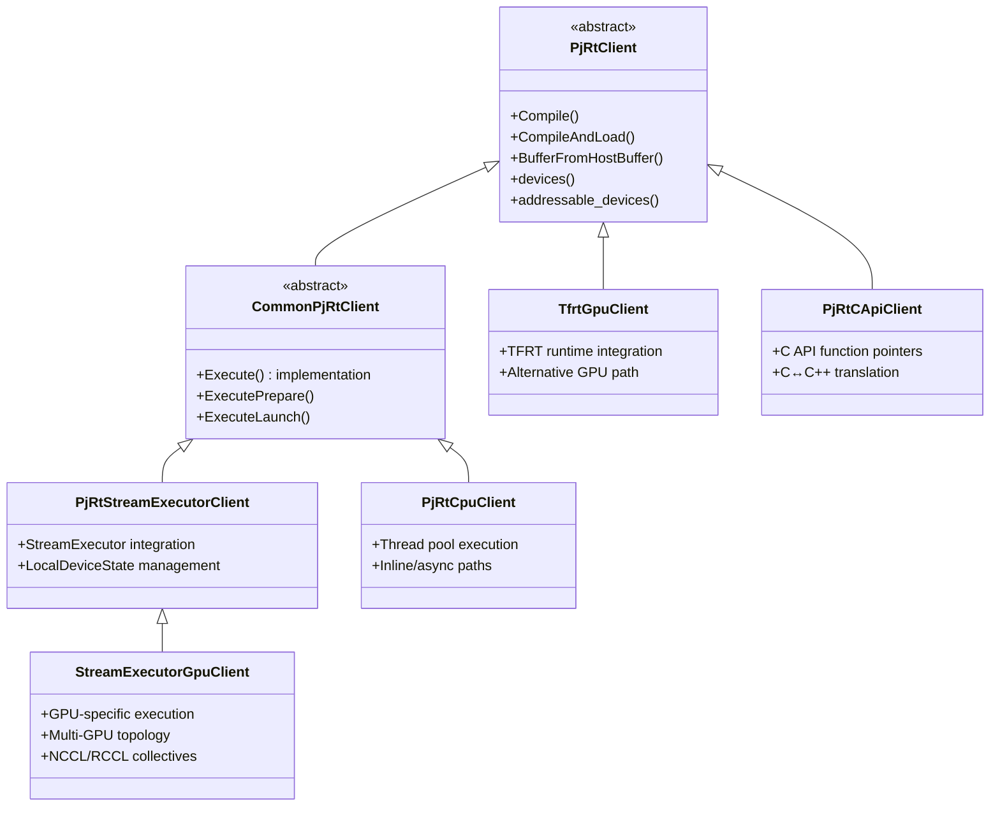
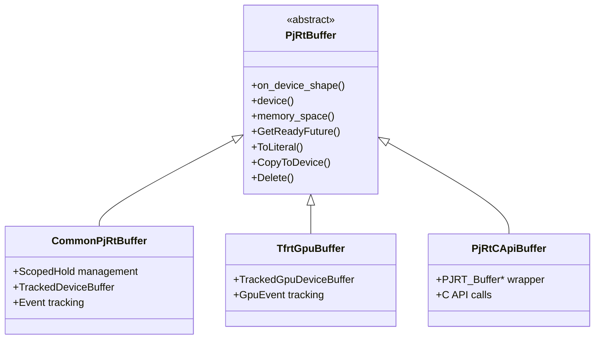
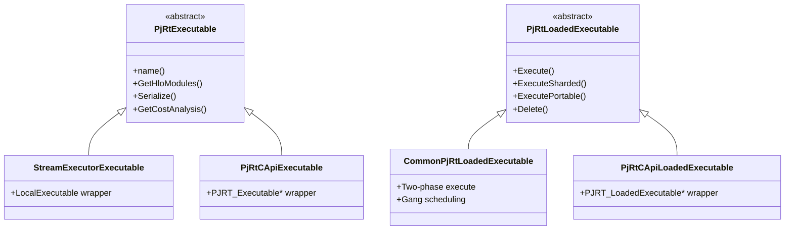

# PJRT Architecture Deep Dive

> **Prerequisites:** Read the [Introduction](index.md) for PJRT's vision and goals,
> and the [C++ API Overview](cpp_api_overview.md) for class-level summaries.

PJRT (**P**retty much **J**ust another **R**un**T**ime) is XLA's hardware
abstraction layer. This document explains how PJRT is structured internally --
the layering between C and C++ APIs, the plugin system, the extension mechanism,
and the class hierarchy that backends implement.

> **Video resource:** The
> [PJRT Plugin Tutorial (OpenXLA 2024 Fall DevLab)](https://www.youtube.com/watch?v=2GlMqaNxP_w)
> covers plugin architecture and integration end-to-end.
> [Companion slides](https://drive.google.com/file/d/1epUJkMONG2t06WOeMHz4Oi3F_-8cTuz-/view).

## Table of Contents

- [Two-Layer Architecture](#two-layer-architecture)
- [C API: The PJRT_Api Struct](#c-api-the-pjrt_api-struct)
- [Opaque Struct Pattern: C-to-C++ Bridge](#opaque-struct-pattern-c-to-c-bridge)
- [Reverse Wrapping: PjRtCApiClient](#reverse-wrapping-pjrtcapiclient)
- [Extension System](#extension-system)
- [Plugin Loading and Registration](#plugin-loading-and-registration)
- [Class Hierarchy](#class-hierarchy)
- [Further Resources](#further-resources)

---

## Two-Layer Architecture

PJRT uses a two-layer design to separate **stability** from **expressiveness**:



**Why two layers?**

| Layer | Purpose | Consumers |
|-------|---------|-----------|
| **C API** (`pjrt_c_api.h`) | Stable ABI boundary. Plugins compiled against one version can work with newer frameworks. Pure C for language interop. | Plugin authors, non-C++ frameworks |
| **C++ API** (`pjrt_client.h`) | Rich types (`absl::Status`, `std::unique_ptr`, `Shape`). Convenient for XLA-internal code and frameworks that link XLA directly. | JAX, TensorFlow, XLA internals |

The C API is the **plugin contract** -- hardware vendors implement it. The C++
API is the **framework interface** -- ML frameworks consume it. The
`PjRtCApiClient` class bridges the two.

> **Source files:**
> - C API: [`xla/pjrt/c/pjrt_c_api.h`](../../xla/pjrt/c/pjrt_c_api.h)
> - C++ API: [`xla/pjrt/pjrt_client.h`](../../xla/pjrt/pjrt_client.h)

---

## C API: The PJRT_Api Struct

The entire C API surface is a single struct of function pointers: `PJRT_Api`.
A plugin populates this struct and returns a pointer to it. The framework calls
through these pointers.

### Function Pointer Groups

The ~160 function pointers in `PJRT_Api` are organized by resource type:

```mermaid
flowchart TD
    API["PJRT_Api struct"]

    API --> Error["Error (3)<br/>Destroy, Message, GetCode"]
    API --> Plugin["Plugin (2)<br/>Initialize, Attributes"]
    API --> Event["Event (7)<br/>Destroy, IsReady, Error,<br/>Await, OnReady, Create, Set"]
    API --> Client["Client (16)<br/>Create, Destroy, PlatformName,<br/>Devices, Compile,<br/>BufferFromHostBuffer, ..."]
    API --> DevDesc["DeviceDescription (6)<br/>Id, ProcessIndex, Attributes,<br/>Kind, DebugString, ToString"]
    API --> Device["Device (8)<br/>GetDescription, IsAddressable,<br/>LocalHardwareId, Memories,<br/>MemoryStats, PoisonExecution, ..."]
    API --> Memory["Memory (6)<br/>Id, Kind, Kind_Id,<br/>DebugString, ToString,<br/>AddressableByDevices"]
    API --> Exec["Executable (15)<br/>Destroy, Name, NumReplicas,<br/>Serialize, Fingerprint,<br/>CostAnalysis, ..."]
    API --> Loaded["LoadedExecutable (8)<br/>Destroy, Execute, Delete,<br/>AddressableDevices,<br/>GetDeviceAssignment, ..."]
    API --> Buffer["Buffer (21)<br/>Destroy, ElementType, Dimensions,<br/>CopyToDevice, ToHostBuffer,<br/>ReadyEvent, Donate, Bitcast, ..."]
    API --> Stream["CopyToDeviceStream (5)<br/>Destroy, AddChunk,<br/>TotalBytes, GranuleSize,<br/>CurrentBytes"]
    API --> Topo["TopologyDescription (8)<br/>Create, Destroy, PlatformName,<br/>GetDeviceDescriptions,<br/>Serialize, Deserialize, ..."]
    API --> Async["AsyncHostToDevice (7)<br/>Destroy, TransferData,<br/>RetrieveBuffer, Device,<br/>BufferCount, BufferSize, ..."]
    API --> Misc["Miscellaneous<br/>Compile (standalone AOT),<br/>ExecuteContext, DmaMap/Unmap,<br/>AliasBuffer, ErrorBuffer, ..."]
```



### ABI Versioning

```c
#define PJRT_API_MAJOR 0    // Bumped for ABI-incompatible changes
#define PJRT_API_MINOR 103  // Bumped for compatible additions
```

**Compatibility rules:**

- **Major version mismatch** = incompatible, plugin cannot be loaded
- **Minor version**: Framework can detect plugin awareness of newer fields via
  `struct_size` checks. New fields are always appended to the end of `PJRT_Api`
  and arg structs.

Every arg struct contains a `struct_size` field as its first member. The
`PJRT_STRUCT_SIZE(type, last_field)` macro computes the expected size. This
lets newer code detect whether the caller knows about recently-added fields:

```c
// Safe initialization pattern
PJRT_Client_Create_Args args;
args.struct_size = PJRT_Client_Create_Args_STRUCT_SIZE;
// ... fill remaining fields ...
PJRT_Error* error = api->PJRT_Client_Create(&args);
```

> **Source:** [`xla/pjrt/c/pjrt_c_api.h`](../../xla/pjrt/c/pjrt_c_api.h) -- `PJRT_STRUCT_SIZE` / `PJRT_DEFINE_STRUCT_TRAITS` macros, `PJRT_API_MAJOR` / `PJRT_API_MINOR` versioning constants, `PJRT_Api` struct definition

---

## Opaque Struct Pattern: C-to-C++ Bridge

The C API uses opaque structs to wrap C++ objects. This is the **"bottom
sandwich"** -- the layer between the C API and the concrete C++ backend
implementation.

### Key Wrapper Structs

```c
// xla/pjrt/c/pjrt_c_api_wrapper_impl.h

struct PJRT_Error {
  absl::Status status;
};

struct PJRT_Client {
  std::unique_ptr<xla::PjRtClient> client;       // The C++ client
  std::vector<PJRT_Device> owned_devices;         // C wrappers for devices
  std::vector<PJRT_Device*> devices;              // Pointer array for C API
  std::vector<PJRT_Device*> addressable_devices;
  absl::flat_hash_map<xla::PjRtDevice*, PJRT_Device*>
      c_device_from_cpp_device;                   // Reverse lookup
  std::vector<PJRT_Memory> owned_memories;
  // ...
};

struct PJRT_Device {
  xla::PjRtDevice* device;          // Borrowed from C++ client
  PJRT_DeviceDescription description;
  PJRT_Client* client;              // Back-pointer to owning client
};

struct PJRT_Buffer {
  std::shared_ptr<xla::PjRtBuffer> shared_buffer;
  // ...
};

struct PJRT_Executable {
  std::shared_ptr<xla::PjRtExecutable> shared_executable;
  // Cached cost analysis, fingerprint, etc.
};
```

The pattern is consistent: each C struct holds a pointer (or smart pointer) to
the corresponding C++ object, plus any cached/pre-computed data needed for the
C API.

**Ownership rules:**
- `PJRT_Client` **owns** its `PjRtClient` via `unique_ptr`
- `PJRT_Device` **borrows** from the client (raw pointer, lifetime tied to client)
- `PJRT_Buffer` and `PJRT_Executable` use `shared_ptr` for flexible ownership

> **Source:** [`xla/pjrt/c/pjrt_c_api_wrapper_impl.h`](../../xla/pjrt/c/pjrt_c_api_wrapper_impl.h) -- `PJRT_Error`, `PJRT_Client`, `PJRT_Device`, `PJRT_Memory`, `PJRT_Buffer`, `PJRT_Executable` struct definitions

---

## Reverse Wrapping: PjRtCApiClient

When a framework loads a plugin via the C API, it needs C++ objects to work with.
The `PjRtCApiClient` classes provide the **"top sandwich"** -- C++ wrappers
around the C API function pointers.



### Wrapper Classes

| C++ Wrapper | Wraps C Type | Purpose |
|-------------|-------------|---------|
| `PjRtCApiClient` | `PJRT_Client*` | Client operations (compile, buffer creation) |
| `PjRtCApiDevice` | `PJRT_Device*` | Device queries |
| `PjRtCApiMemorySpace` | `PJRT_Memory*` | Memory space queries |
| `PjRtCApiBuffer` | `PJRT_Buffer*` | Buffer operations (transfer, delete) |
| `PjRtCApiExecutable` | `PJRT_Executable*` | Unloaded executable metadata |
| `PjRtCApiLoadedExecutable` | `PJRT_LoadedExecutable*` | Execute, device assignment |
| `PjRtCApiTopologyDescription` | `PJRT_TopologyDescription*` | Topology for AOT compilation |
| `PjRtCApiCompiler` | `PJRT_Api*` (compile fn) | AOT compilation |

Each wrapper holds a pointer to the C API struct **and** a pointer to the
`PJRT_Api` function table. Every method translates: C++ arguments → C arg
struct → C API call → error check → wrap result.

### Full Wrapping Chain

For a plugin-based backend, a single C++ method call traverses **four layers**:

```
Framework call (C++ types)
  → PjRtCApiClient (C++ → C translation)
    → PJRT_Api function pointer (C ABI boundary)
      → pjrt_c_api_wrapper_impl (C → C++ unwrapping)
        → Concrete PjRtClient method (actual work)
```

For a directly-linked backend (no plugin), the path is shorter:

```
Framework call (C++ types)
  → Concrete PjRtClient method (actual work)
```

> **Source:** [`xla/pjrt/c_api_client/pjrt_c_api_client.h`](../../xla/pjrt/c_api_client/pjrt_c_api_client.h)
> and its [README](../../xla/pjrt/c_api_client/README.md)

---

## Extension System

The core `PJRT_Api` struct is versioned and append-only, but some features are
**optional** or **platform-specific**. PJRT uses an extension linked list for
these.

### How It Works

`PJRT_Api` and `PJRT_Api_Version` both contain an `extension_start` pointer.
Extensions form a singly-linked list:



To find an extension, traverse the list checking the `type` field:

```c
typedef struct PJRT_Extension_Base {
  size_t struct_size;
  PJRT_Extension_Type type;
  struct PJRT_Extension_Base* next;  // Linked list
} PJRT_Extension_Base;
```

Each concrete extension struct **embeds** `PJRT_Extension_Base` as its first
member and adds extension-specific function pointers after it.

### Extension Types

| Extension Type | Purpose | Typical Backends |
|---------------|---------|-----------------|
| `Gpu_Custom_Call` | Register custom GPU kernels | GPU |
| `Profiler` | Profiling integration | All |
| `Custom_Partitioner` | Custom SPMD partitioning | All |
| `Stream` | Access underlying device streams (CUDA/HIP) | GPU |
| `Layouts` | Custom layout support | All |
| `FFI` | Foreign Function Interface for custom calls | All |
| `MemoryDescriptions` | Describe available memory types | All |
| `Triton` | Triton kernel integration | GPU |
| `RawBuffer` | Raw buffer access (experimental) | All |
| `PhaseCompile` | Multi-phase compilation (experimental) | All |
| `CrossHostTransfers` | Cross-host buffer transfers | GPU, TPU |
| `ExecutableMetadata` | Additional executable metadata | All |
| `Callback` | Host callback support | All |
| `HostAllocator` | Custom host memory allocation (experimental) | All |
| `TpuTopology` | TPU topology queries | TPU |
| `TpuExecutable` | TPU executable metadata | TPU |
| `Megascale` | Large-scale training support | TPU |
| `Shardings` | Sharding specification support | All |
| `AbiVersion` | ABI version negotiation | All |
| `Collectives` | Collective operations | All |
| `MultiSlice` | Multi-slice/DCN configuration | GPU, TPU |

Extensions enable **backward compatibility**: a new feature can be added as an
extension without changing the core `PJRT_Api` struct. Older plugins simply
won't have the extension in their list.

> **Source:** [`xla/pjrt/c/pjrt_c_api.h`](../../xla/pjrt/c/pjrt_c_api.h) -- `PJRT_Extension_Type` enum and `PJRT_Extension_Base` struct
> Extension headers: `xla/pjrt/c/pjrt_c_api_*_extension.h`
> Example: [`xla/pjrt/extensions/example/`](../../xla/pjrt/extensions/example/README.md)

---

## Plugin Loading and Registration

PJRT plugins can be loaded **dynamically** (shared library) or linked
**statically**.

### Dynamic Loading



The key functions in the registry (`xla/pjrt/pjrt_api.h`):

```cpp
namespace pjrt {
// Global registry (case-insensitive device_type keys)
absl::StatusOr<const PJRT_Api*> PjrtApi(absl::string_view device_type);
absl::Status SetPjrtApi(absl::string_view device_type, const PJRT_Api* api);

// Dynamic loading: dlopen + dlsym("GetPjrtApi") + SetPjrtApi
absl::StatusOr<const PJRT_Api*> LoadPjrtPlugin(
    absl::string_view device_type, absl::string_view library_path);

// Call PJRT_Plugin_Initialize
absl::Status InitializePjrtPlugin(absl::string_view device_type);
}
```

### Static Linking

For backends compiled into the same binary, direct function calls bypass the
registry:

```cpp
// Direct entry points (no dlopen needed)
GetXlaCpuPjrtPlugin()   // → const PJRT_Api* for CPU
GetXlaGpuPjrtPlugin()   // → const PJRT_Api* for GPU
GetXlaTpuPjrtPlugin()   // → const PJRT_Api* for TPU
```

Alternatively, static registration macros register plugins at startup:

```cpp
// In xla/pjrt/plugin/xla_cpu/cpu_static_registration.cc
REGISTER_PJRT_PLUGIN(kCpuPjrtName, GetCpuPjrtApi())
```

### Two Integration Paths Summary

| Path | Mechanism | When to Use |
|------|-----------|-------------|
| **Dynamic** (`GetCApiPlugin`) | Runtime plugin name → registry lookup | Flexible, supports multiple plugins, JAX default |
| **Static** (`GetXla...PjrtPlugin`) | Direct function call | Simpler, single-binary deployments |

See the [Plugin README](../../xla/pjrt/plugin/README.md)
for detailed integration instructions.

> **Source:** [`xla/pjrt/pjrt_api.h`](../../xla/pjrt/pjrt_api.h),
> [`xla/pjrt/plugin/README.md`](../../xla/pjrt/plugin/README.md)

---

## Class Hierarchy

### PjRtClient Hierarchy



### PjRtBuffer Hierarchy



### PjRtExecutable Hierarchy



### Key Design Points

- **`CommonPjRtClient`** provides shared execution logic (two-phase
  prepare/launch, gang scheduling) used by both CPU and GPU StreamExecutor
  backends.
- **`PjRtStreamExecutorClient`** adds StreamExecutor integration (streams,
  events, device state) for backends that use StreamExecutor (GPU).
- **`PjRtCApiClient`** is the universal C++ wrapper -- any C API plugin can be
  consumed through it, regardless of the backend's internal implementation.
- **`TfrtGpuClient`** is an independent GPU implementation using the TFRT
  runtime, not inheriting from `CommonPjRtClient`.

> **Source files:**
> - [`xla/pjrt/pjrt_client.h`](../../xla/pjrt/pjrt_client.h) -- `PjRtClient`, `PjRtBuffer`, `PjRtLoadedExecutable`
> - [`xla/pjrt/common_pjrt_client.h`](../../xla/pjrt/common_pjrt_client.h) -- `CommonPjRtClient`, `CommonPjRtLoadedExecutable`
> - [`xla/pjrt/pjrt_stream_executor_client.h`](../../xla/pjrt/pjrt_stream_executor_client.h) -- `PjRtStreamExecutorClient`
> - [`xla/pjrt/gpu/se_gpu_pjrt_client.h`](../../xla/pjrt/gpu/se_gpu_pjrt_client.h) -- `StreamExecutorGpuClient`
> - [`xla/pjrt/cpu/cpu_client.h`](../../xla/pjrt/cpu/cpu_client.h) -- `PjRtCpuClient`
> - [`xla/pjrt/gpu/tfrt/tfrt_gpu_client.h`](../../xla/pjrt/gpu/tfrt/tfrt_gpu_client.h) -- `TfrtGpuClient`
> - [`xla/pjrt/c_api_client/pjrt_c_api_client.h`](../../xla/pjrt/c_api_client/pjrt_c_api_client.h) -- `PjRtCApiClient`

---

## Further Resources

- [PJRT Plugin Tutorial (video)](https://www.youtube.com/watch?v=2GlMqaNxP_w) -- OpenXLA 2024 Fall DevLab
- [XLA Overview (video)](https://www.youtube.com/watch?v=kAOanJczHA0)
- [OpenXLA DevLab playlist](https://www.youtube.com/playlist?list=PLlFotmaRrOzv2OIEpijqiHGmY7rpscFcj)
- [PJRT C API ABI Versioning Design Doc](https://docs.google.com/document/d/1TKB5NyGtdzrpgw5mpyFjVAhJjpSNdF31T6pjPl_UT2o/edit)
- [PJRT Plugin Mechanism Design Doc](https://docs.google.com/document/d/1Qdptisz1tUPGn1qFAVgCV2omnfjN01zoQPwKLdlizas/edit)
- [PJRT Design Docs (Google Drive folder)](https://drive.google.com/drive/folders/18M944-QQPk1E34qRyIjkqDRDnpMa3miN)
- Related documentation: [C API Reference](c_api_reference.md) |
  [Compilation Pipeline](compilation_pipeline.md) |
  [Execution Pipeline](execution_pipeline.md) |
  [Buffer Management](buffer_management.md)
- Backend details: [GPU](backend_gpu.md) | [CPU](backend_cpu.md) | [TPU](backend_tpu.md)
