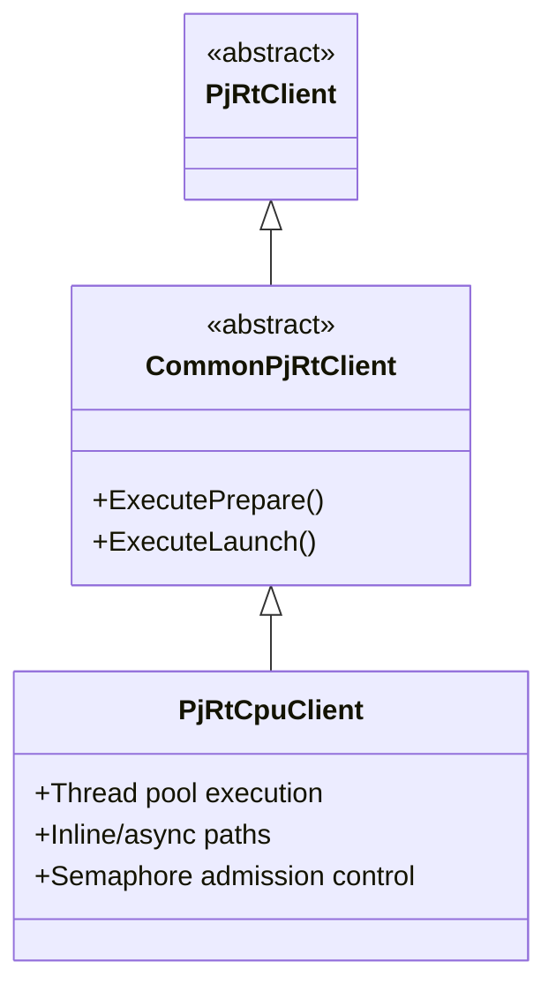
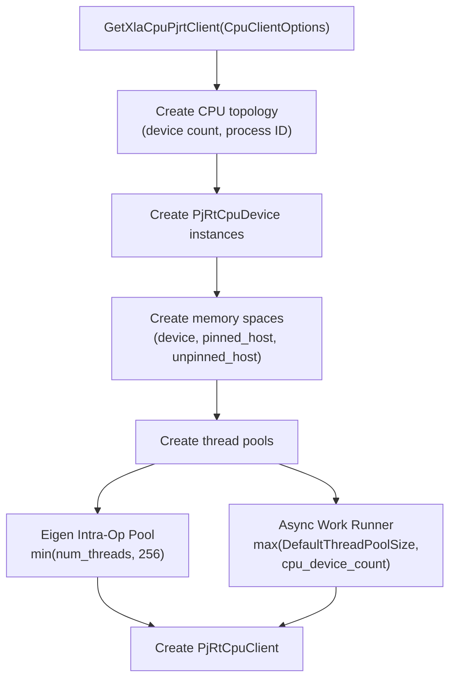
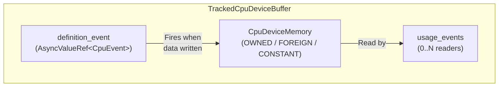
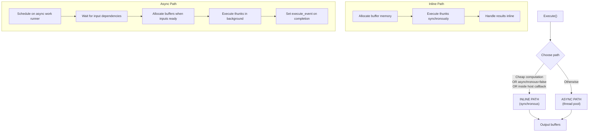
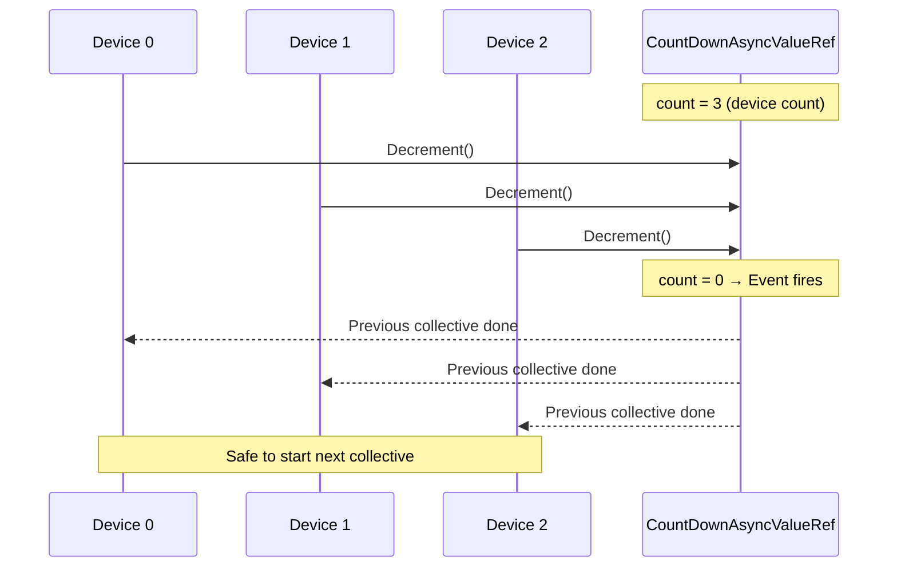
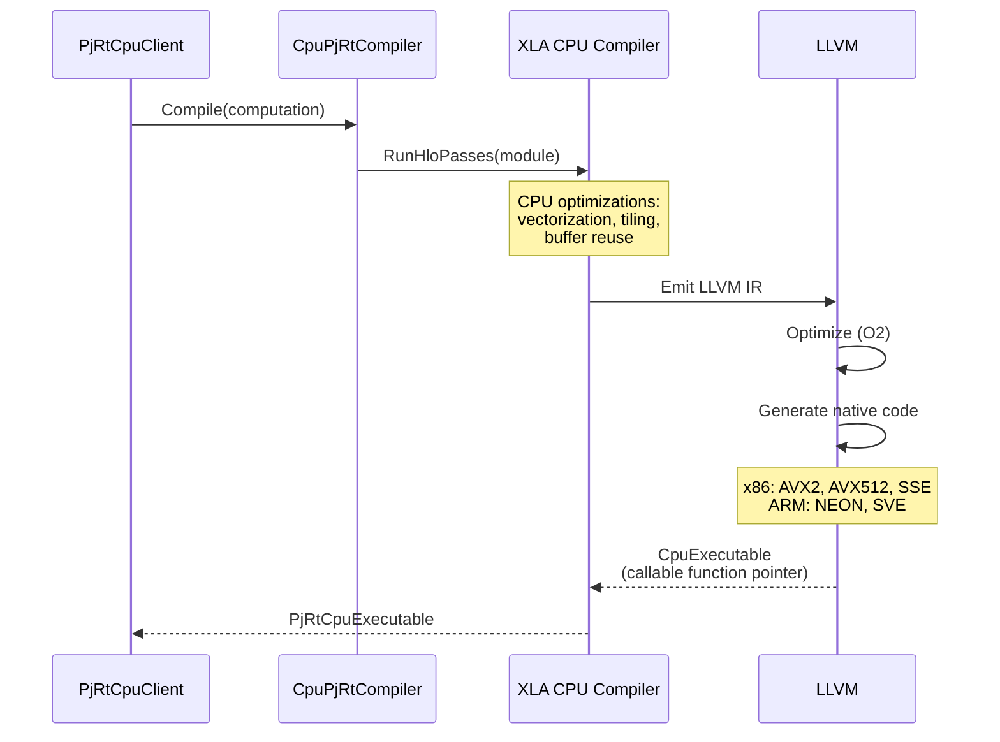

# CPU Backend (Intel x86 / ARM)

> **Prerequisites:** Read the [Architecture Deep Dive](architecture.md),
> [Compilation Pipeline](compilation_pipeline.md),
> [Execution Pipeline](execution_pipeline.md), and
> [Buffer Management](buffer_management.md) for the common PJRT concepts this
> backend implements.

This document covers the CPU-specific PJRT implementation. The CPU backend
handles Intel x86 and ARM architectures transparently through LLVM.

## Table of Contents

- [Overview](#overview)
- [Client Initialization](#client-initialization)
- [Memory Model](#memory-model)
- [Execution Model](#execution-model)
- [Collective Operations](#collective-operations)
- [Compilation](#compilation)
- [C API Entry Points](#c-api-entry-points)
- [Further Resources](#further-resources)

---

## Overview



Key characteristics:
- **No StreamExecutor** -- direct execution model (function pointer calls)
- **Intel/ARM transparency** -- architecture handled entirely by LLVM target
  configuration
- **Thread pool based** -- Eigen intra-op pool for within-kernel parallelism,
  async work runner for between-kernel scheduling
- **kSynchronous allocation model** -- simplest memory management

> **Source:** [`xla/pjrt/cpu/cpu_client.h`](../../xla/pjrt/cpu/cpu_client.h)

---

## Client Initialization



### CpuClientOptions

| Option | Default | Description |
|--------|---------|-------------|
| `cpu_device_count` | 1 | Number of logical CPU devices |
| `asynchronous` | true | Enable async execution |
| `max_transpose_threads` | auto | Thread limit for buffer layout transposition |
| `process_id` | 0 | This process's ID in distributed setup |
| `collectives` | none | Collective communication implementation |
| `topology` | auto | Custom topology description |
| `allocator` | default | Custom memory allocation function |

### Thread Pools

| Pool | Size | Stack Size | Purpose |
|------|------|------------|---------|
| Eigen intra-op | min(num_threads, 256) | 8 MB | Parallelism **within** operations (GEMM, element-wise) |
| Async work runner | max(default, device_count) | 8 MB | Dispatch between operations (async execution) |

The large 8 MB stack size accommodates BLAS/LAPACK functions which can use
significant stack space.

**Constraint:** Thread pool size must be >= device count to support running a
single collective across all devices without deadlock.

> **Source:**
> - [`xla/pjrt/plugin/xla_cpu/cpu_client_options.h`](../../xla/pjrt/plugin/xla_cpu/cpu_client_options.h)
> - [`xla/pjrt/cpu/cpu_client.cc`](../../xla/pjrt/cpu/cpu_client.cc)

---

## Memory Model

The CPU backend uses the **kSynchronous** allocation model -- the simplest of
the three models (see
[Buffer Management: Allocation Models](buffer_management.md#memory-allocation-models)).

### Memory Spaces

| Space | Kind String | Description |
|-------|-------------|-------------|
| `CpuDeviceMemorySpace` | `"device"` | Main host memory (default) |
| `PinnedHostMemorySpace` | `"pinned_host"` | Pinned for fast DMA (host offloading) |
| `UnpinnedHostMemorySpace` | `"unpinned_host"` | Regular host memory |

All three spaces point to host memory -- the distinction is for **framework
semantics** (e.g., JAX host offloading uses pinned host memory).

### Buffer Tracking



**CpuDeviceMemory ownership types:**
- **OWNED** -- Allocated by the framework; freed on destruction
- **FOREIGN** -- User-allocated; notification callback on destruction
- **CONSTANT** -- Static lifetime (global constants); never freed

**CpuEvent:** A simple marker struct used via `AsyncValueRef<CpuEvent>` for
dependency tracking. Events are set to "concrete" when complete, or "error"
on failure.

### Zero-Copy Host Buffers

When the host buffer layout matches the expected device layout exactly (same
element type, dimensions, and memory layout), `BufferFromHostBuffer` can use
**zero-copy** mode -- the host pointer is used directly without copying.

When layouts differ, data is transposed/linearized into the correct layout
using the transpose cache (backed by the Eigen thread pool).

> **Source:**
> - [`xla/pjrt/cpu/tracked_cpu_device_buffer.h`](../../xla/pjrt/cpu/tracked_cpu_device_buffer.h)
> - [`xla/pjrt/cpu/cpu_event.h`](../../xla/pjrt/cpu/cpu_event.h)

---

## Execution Model

The CPU backend supports two execution paths, chosen per-operation:



### Inline vs Async Decision

| Condition | Path | Reason |
|-----------|------|--------|
| `cheap_computation_` flag set | Inline | Overhead of async dispatch exceeds computation time |
| `asynchronous_ = false` | Inline | Client configured for synchronous execution |
| Inside host callback | Inline | Avoid thread pool deadlock |
| `ExecuteOptions` override | As specified | Framework explicitly requested |
| Default | Async | Best throughput for non-trivial computations |

The `cheap_computation_` flag is set during compilation based on
`HloCostAnalysis` -- if the estimated FLOPS are below a threshold.

### Admission Control

Each device has a **semaphore** limiting concurrent in-flight computations:

```
max_inflight_computations (default: 32)
```

This prevents:
- Unbounded memory growth from too many queued computations
- Thread pool starvation
- Memory fragmentation from excessive concurrent allocations

The semaphore uses RAII (`Semaphore::ScopedReservation`) -- acquired before
execution, released when execution completes.

### Execution Stream Ordering

The `ExecutionStreamEventMap` provides stream-like ordering semantics on CPU:

```
Stream ID → Last execution event (AsyncValueRef<CpuEvent>)
```

Operations on the same "stream" are serialized by waiting on the previous
event. This enables the two-phase execution model from `CommonPjRtClient`.

> **Source:**
> - [`xla/pjrt/cpu/cpu_client.cc`](../../xla/pjrt/cpu/cpu_client.cc) -- `PjRtCpuLoadedExecutable::CheckBufferCompatibilities` through `CpuPjRtRawLoadedExecutable::Execute`
> - [`xla/pjrt/cpu/cpu_async_execution_tracker.h`](../../xla/pjrt/cpu/cpu_async_execution_tracker.h)
> - [`xla/pjrt/cpu/execution_stream_event_map.h`](../../xla/pjrt/cpu/execution_stream_event_map.h)

---

## Collective Operations

CPU collectives are used when multiple logical CPU devices need to communicate
(e.g., multi-device SPMD):

### Gang-Scheduled Countdown Events



**Why gang scheduling?** With a fixed-size thread pool, if collectives aren't
synchronized, thread starvation can cause deadlock:
- Device 0 starts all-reduce, waits for Device 1
- But Device 1's thread is busy with a different computation
- Deadlock

Gang scheduling ensures all devices reach the collective barrier before any
proceeds.

### Collective Implementations

| Implementation | Scope | Description |
|---------------|-------|-------------|
| `InProcessCollectives` | Single process | Direct memory access between CPU devices |
| `GlooCollectives` | Multi-process | Uses Gloo library for distributed CPU collectives |

> **Source:** [`xla/backends/cpu/collectives/`](../../xla/backends/cpu/collectives)

---

## Compilation

The CPU compiler uses LLVM to generate native machine code:



### Architecture-Specific Code Generation

The CPU backend uses `TargetMachineOptions` to configure LLVM:

| Field | Example (x86) | Example (ARM) |
|-------|---------------|---------------|
| `triple` | `x86_64-unknown-linux-gnu` | `aarch64-unknown-linux-gnu` |
| `cpu` | `skylake` | `cortex-a72` |
| `enabled_features` | `+avx2,+fma` | `+neon,+sve` |
| `disabled_features` | `-avx512` | (none) |

CPU features are **auto-detected** at runtime via `DetectMachineAttributes()`,
which uses the TSL platform layer for cross-platform detection. The feature set
can be limited via a `max_feature` setting.

**There is no Intel vs ARM divergence in the PJRT layer** -- all architecture
differences are handled by LLVM's code generation.

The compiled `CpuExecutable` is a **directly callable function pointer** -- no
kernel launch or stream dispatch overhead.

> **Source:**
> - [`xla/pjrt/cpu/cpu_pjrt_compiler.h`](../../xla/pjrt/cpu/cpu_pjrt_compiler.h)
> - [`xla/backends/cpu/target_machine_options.h`](../../xla/backends/cpu/target_machine_options.h)
> - [`xla/backends/cpu/codegen/cpu_features.h`](../../xla/backends/cpu/codegen/cpu_features.h)

---

## C API Entry Points

The CPU plugin exports the C API via:

```c
// xla/pjrt/c/pjrt_c_api_cpu.h
const PJRT_Api* GetPjrtApi();
```

**CPU-specific `PJRT_Client_Create` options:**

| Key | Type | Description |
|-----|------|-------------|
| `"cpu_device_count"` | int | Number of logical CPU devices |
| `"process_id"` | int | This process's ID in distributed setup |
| `"asynchronous"` | bool | Enable async execution |

### Device ID Packing

```cpp
constexpr int kMaxCpuDevicesPerProcess = 1 << 11;  // 2048
GlobalDeviceId = process_index * 2048 + local_device_id
```

> **Source:**
> - [`xla/pjrt/c/pjrt_c_api_cpu.h`](../../xla/pjrt/c/pjrt_c_api_cpu.h)
> - [`xla/pjrt/plugin/xla_cpu/cpu_topology.h`](../../xla/pjrt/plugin/xla_cpu/cpu_topology.h)

---

## Further Resources

- [Architecture Deep Dive](architecture.md) -- overall PJRT structure
- [Compilation Pipeline](compilation_pipeline.md#cpu-compilation) -- CPU compilation details
- [Execution Pipeline](execution_pipeline.md) -- common execution model
- [Buffer Management](buffer_management.md) -- buffer lifecycle and events
- Other backends: [GPU](backend_gpu.md) | [TPU](backend_tpu.md)
- [OpenXLA DevLab playlist](https://www.youtube.com/playlist?list=PLlFotmaRrOzv2OIEpijqiHGmY7rpscFcj)
