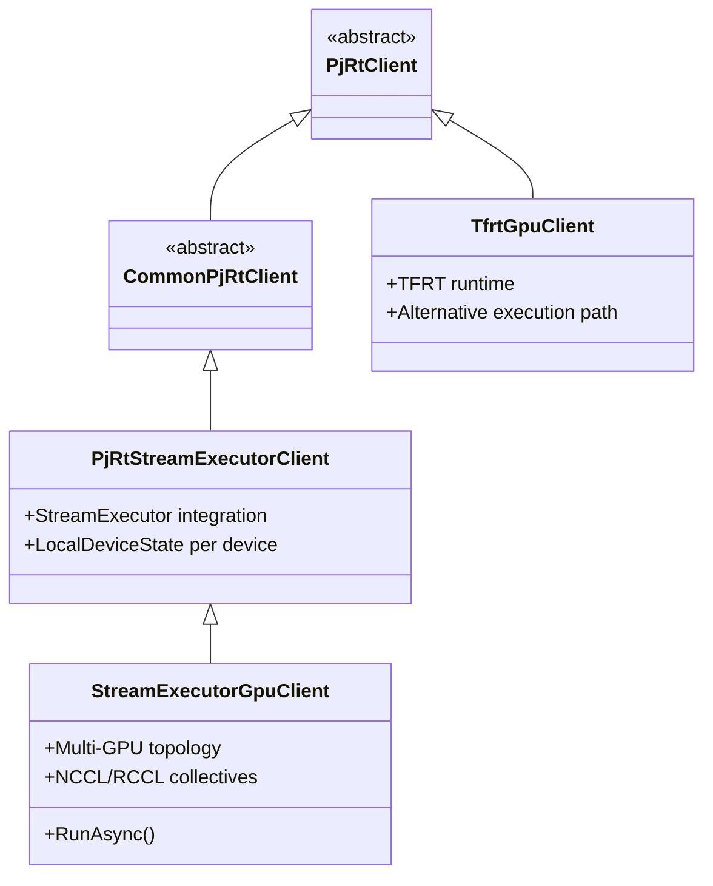
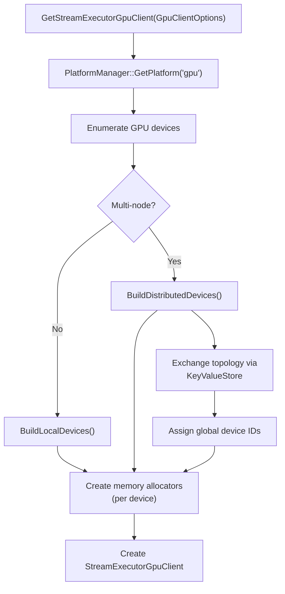
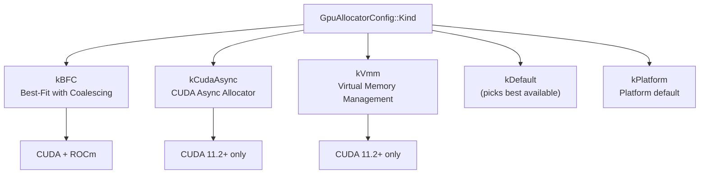
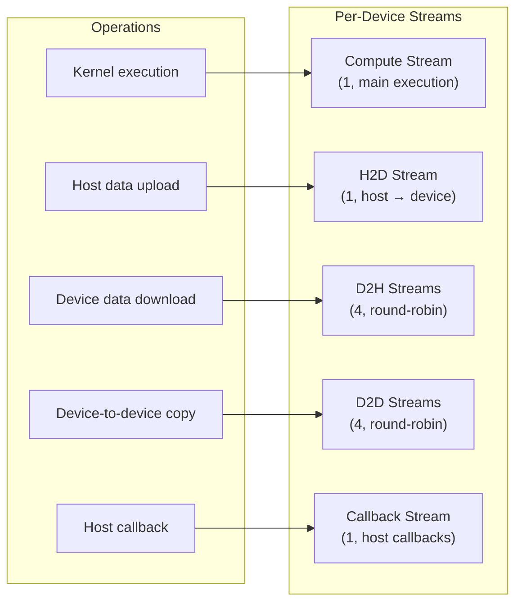
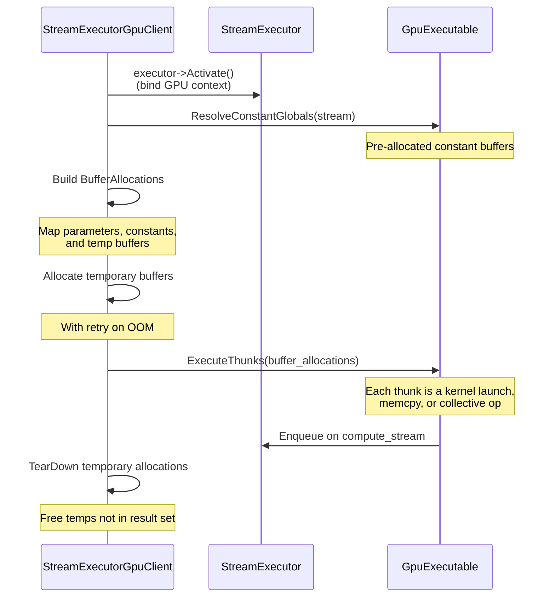
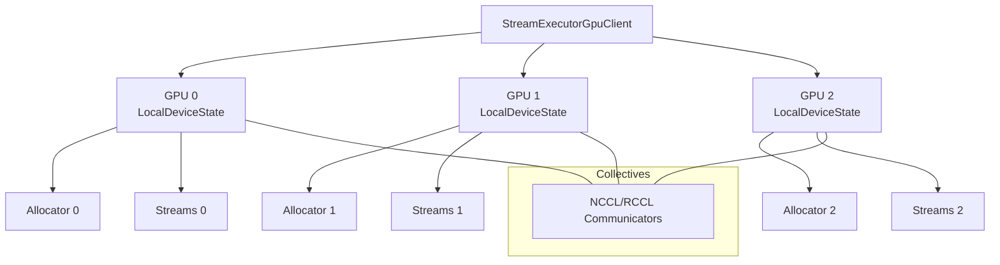
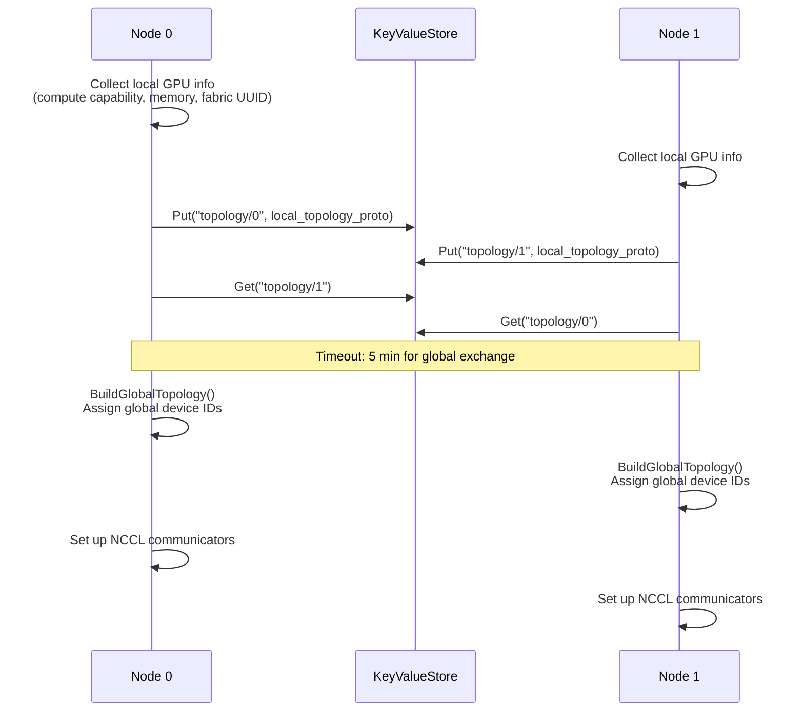

# GPU Backend (NVIDIA CUDA / AMD ROCm)

> **Prerequisites:** Read the [Architecture Deep Dive](architecture.md),
> [Compilation Pipeline](compilation_pipeline.md),
> [Execution Pipeline](execution_pipeline.md), and
> [Buffer Management](buffer_management.md) for the common PJRT concepts this
> backend implements.

This document covers the GPU-specific PJRT implementation, supporting both
NVIDIA CUDA and AMD ROCm platforms.

## Table of Contents

- [Overview](#overview)
- [Client Initialization](#client-initialization)
- [Memory Allocators](#memory-allocators)
- [Stream Management](#stream-management)
- [Execution Flow](#execution-flow)
- [Multi-GPU and Distributed](#multi-gpu-and-distributed)
- [GPU Extensions](#gpu-extensions)
- [C API Entry Points](#c-api-entry-points)
- [Further Resources](#further-resources)

---

## Overview

The GPU backend provides **two runtime paths**:



| Runtime | Class | Description |
|---------|-------|-------------|
| **StreamExecutor** | `StreamExecutorGpuClient` | Primary path. Uses StreamExecutor for device abstraction. Thunk-based execution. |
| **TFRT** | `TfrtGpuClient` | Alternative path using TensorFlow Runtime. Independent implementation. |

### CUDA vs ROCm

The same client classes serve both platforms via conditional compilation:

```cpp
#if GOOGLE_CUDA
  // NVIDIA CUDA path
  platform_id = stream_executor::cuda::kCudaPlatformId;
#elif TENSORFLOW_USE_ROCM
  // AMD ROCm path
  platform_id = stream_executor::rocm::kROCmPlatformId;
#endif
```

Platform detection at runtime:
```cpp
StreamExecutorGpuClient::platform_version()
  // Returns "cuda 12040" or "rocm 60100"
```

> **Source:** [`xla/pjrt/gpu/se_gpu_pjrt_client.h`](../../xla/pjrt/gpu/se_gpu_pjrt_client.h)

---

## Client Initialization



### GpuClientOptions

Key configuration:

| Option | Default | Description |
|--------|---------|-------------|
| `node_id` | 0 | This node's ID in multi-node setup |
| `num_nodes` | 1 | Total node count |
| `allowed_devices` | all | Restrict to specific GPU ordinals |
| `platform_name` | auto | Force "cuda" or "rocm" |
| `allocator_config` | BFC | Memory allocator selection |
| `enable_mock_nccl` | false | Use mock collectives for testing |

> **Source:** [`xla/pjrt/plugin/xla_gpu/xla_gpu_client_options.h`](../../xla/pjrt/plugin/xla_gpu/xla_gpu_client_options.h)

---

## Memory Allocators

The GPU backend uses the `kComputeSynchronized` allocation model (see
[Buffer Management: Allocation Models](buffer_management.md#memory-allocation-models)).

### Available Allocators



| Allocator | Platforms | Description | Best For |
|-----------|-----------|-------------|----------|
| **BFC** | CUDA, ROCm | Best-Fit with Coalescing. Sub-allocates from a large reserved pool. | Default, general purpose |
| **CUDA Async** | CUDA 11.2+ | Uses `cudaMallocAsync`. Lower fragmentation. | Workloads with varying memory needs |
| **VMM** | CUDA 11.2+ | Virtual Memory Management. Fine-grained allocation with oversubscription support. | Memory-constrained workloads |

### BFC Configuration

```cpp
GpuAllocatorConfig config;
config.kind = GpuAllocatorConfig::Kind::kBFC;
config.memory_fraction = 0.75;    // Reserve 75% of GPU memory
config.preallocate = true;        // Allocate pool at startup
```

### Per-Device Memory Spaces

Each GPU device has multiple memory spaces managed by a `MultiDeviceAdapter`:

| Memory Space | Purpose |
|-------------|---------|
| Default (device) | Standard GPU HBM for computation |
| Collective | Dedicated memory for NCCL/RCCL operations |
| Host (pinned) | Host memory pinned for fast DMA |
| TempBuffer | Persistent temp space (CUDA 11.2+) |

> **Source:** [`xla/pjrt/gpu/gpu_helpers.h`](../../xla/pjrt/gpu/gpu_helpers.h),
> [`xla/pjrt/gpu/se_gpu_pjrt_client.cc`](../../xla/pjrt/gpu/se_gpu_pjrt_client.cc) -- `GetStreamExecutorGpuDeviceAllocator`

---

## Stream Management

The GPU backend uses **dedicated streams** to overlap computation with data
transfers:



### Stream Assignment

| Stream | Count | Selection | Purpose |
|--------|-------|-----------|---------|
| `compute_stream` | 1 | Fixed | Kernel execution, main computation |
| `host_to_device_stream` | 1 | Fixed | H2D transfers |
| `device_to_host_stream` | 4 | Round-robin | D2H transfers (overlapped) |
| `device_to_device_stream` | 4 | Round-robin | D2D transfers (overlapped) |
| `callback_stream` | 1 | Fixed | Host callback invocation |

Multiple D2H and D2D streams enable **overlapping** multiple transfers with
computation. The round-robin selection ensures even distribution.

> **Source:** [`xla/pjrt/local_device_state.h`](../../xla/pjrt/local_device_state.h)

---

## Execution Flow

The GPU backend uses `StreamExecutorGpuClient::RunAsync` for execution:



### Thunk-Based Execution

The GPU compiler generates a sequence of **thunks** -- small units of device
work:

| Thunk Type | Purpose |
|-----------|---------|
| Kernel launch thunk | Launch a CUDA/HIP kernel |
| Memcpy thunk | Device-to-device memory copy |
| Collective thunk | NCCL/RCCL all-reduce, all-gather, etc. |
| Synchronization thunk | Stream synchronization barrier |
| Conditional thunk | Conditional execution |

Thunks are dispatched **sequentially** on the compute stream. The stream itself
provides ordering guarantees.

### Buffer Alignment

| Buffer Type | Required Alignment |
|------------|-------------------|
| Parameters | 256 bytes |
| Constants | 128 bytes |
| Temporaries | 256 bytes |

> **Source:** [`xla/pjrt/gpu/se_gpu_pjrt_client.cc`](../../xla/pjrt/gpu/se_gpu_pjrt_client.cc) -- `StreamExecutorGpuClient::RunAsync`

---

## Multi-GPU and Distributed

### Local Multi-GPU

Within a single host, multiple GPUs are managed by the same client:



### Multi-Host Topology Exchange

For distributed training across multiple hosts:



**Exchange protocol:**
1. Each node collects local device metadata (compute capability, memory size,
   fabric UUID for NVLink/NVSwitch detection)
2. Topology protos exchanged via `KeyValueStore` (backed by coordination service)
3. Global device IDs assigned: `global_id = process_index * max_devices_per_process + local_ordinal`
4. Partitions determined by boot IDs (same boot ID = same physical host)
5. Device interconnect maps built from fabric UUIDs

### Collectives

| Platform | Library | Description |
|----------|---------|-------------|
| NVIDIA | NCCL | NVIDIA Collective Communications Library |
| AMD | RCCL | ROCm Collective Communications Library |

Collectives are managed through `GpuCliques` -- groups of communicators keyed by
`GpuCliqueKey` (set of participating device IDs + operation type).

> **Source:** [`xla/pjrt/gpu/se_gpu_pjrt_client.cc`](../../xla/pjrt/gpu/se_gpu_pjrt_client.cc) -- `BuildDistributedDevices`

---

## GPU Extensions

The GPU backend supports several PJRT extensions:

| Extension | Header | Purpose |
|-----------|--------|---------|
| `Gpu_Custom_Call` | `pjrt_c_api_gpu_extension.h` | Register custom CUDA/HIP kernels callable from HLO |
| `Stream` | `pjrt_c_api_stream_extension.h` | Get the underlying CUDA/HIP stream for a device (for interop) |
| `Triton` | `pjrt_c_api_triton_extension.h` | Integrate Triton-compiled kernels |
| `CrossHostTransfers` | `pjrt_c_api_cross_host_transfers_extension.h` | Cross-host buffer send/receive |

### Stream Extension Example

```c
// Get the CUDA stream for a device (for use with cuBLAS, cuDNN, etc.)
PJRT_Stream_Extension* stream_ext = FindExtension(api, PJRT_Extension_Type_Stream);
PJRT_Stream_GetStream_Args args = {.device = device};
stream_ext->get_stream(&args);
cudaStream_t cuda_stream = (cudaStream_t)args.stream;
```

> **Source:** Extension headers in [`xla/pjrt/c/`](../../xla/pjrt/c)

---

## C API Entry Points

The GPU plugin exports the C API via:

```c
// xla/pjrt/c/pjrt_c_api_gpu.h
const PJRT_Api* GetPjrtApi();
```

**GPU-specific `PJRT_Client_Create` options:**

| Key | Type | Description |
|-----|------|-------------|
| `"platform_name"` | string | Force "cuda" or "rocm" |
| `"allowed_devices"` | int list | Restrict to specific GPU ordinals |
| `"node_id"` | int | This node's ID in distributed setup |
| `"num_nodes"` | int | Total number of nodes |
| `"allocator"` | string | Allocator type: "default", "bfc", "cuda_async", "vmm" |
| `"memory_fraction"` | float | Fraction of GPU memory to reserve |
| `"preallocate"` | bool | Pre-allocate memory pool at creation |

**Platform registration:**
- CUDA: `se_gpu_pjrt_compiler_cuda_registration.cc` registers compiler with
  `kCudaPlatformId`
- ROCm: `se_gpu_pjrt_compiler_rocm_registration.cc` registers compiler with
  `kROCmPlatformId`

> **Source:**
> - [`xla/pjrt/c/pjrt_c_api_gpu.h`](../../xla/pjrt/c/pjrt_c_api_gpu.h)
> - [`xla/pjrt/plugin/xla_gpu/xla_gpu_pjrt_client.h`](../../xla/pjrt/plugin/xla_gpu/xla_gpu_pjrt_client.h)

---

## Further Resources

- [Architecture Deep Dive](architecture.md) -- overall PJRT structure
- [Compilation Pipeline](compilation_pipeline.md#gpu-compilation) -- GPU compilation details
- [Execution Pipeline](execution_pipeline.md) -- common execution model
- [Buffer Management](buffer_management.md) -- buffer lifecycle and events
- Other backends: [CPU](backend_cpu.md) | [TPU](backend_tpu.md)
- [PJRT Plugin Tutorial (video)](https://www.youtube.com/watch?v=2GlMqaNxP_w)
- [OpenXLA DevLab playlist](https://www.youtube.com/playlist?list=PLlFotmaRrOzv2OIEpijqiHGmY7rpscFcj)
