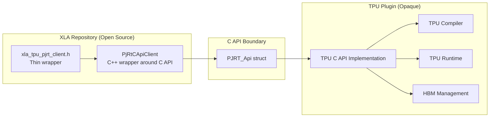
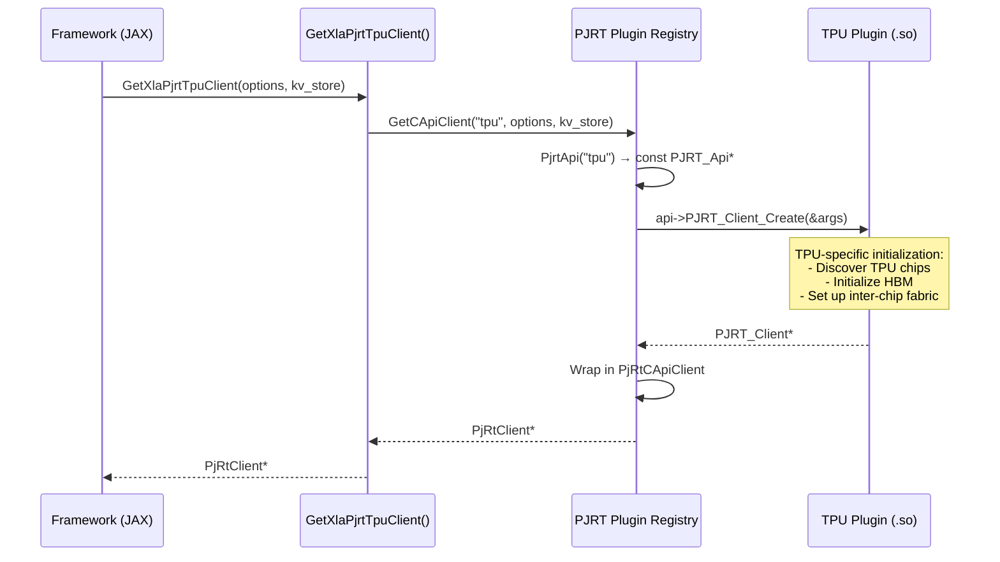

# TPU Backend (Google)

> **Prerequisites:** Read the [Architecture Deep Dive](architecture.md),
> [Compilation Pipeline](compilation_pipeline.md),
> [Execution Pipeline](execution_pipeline.md), and
> [Buffer Management](buffer_management.md) for the common PJRT concepts.

This document covers the TPU-specific PJRT implementation. Unlike the CPU and
GPU backends, the TPU backend is **entirely behind the C API boundary** -- the
XLA open-source repository contains only a thin wrapper that loads the opaque
TPU plugin.

## Table of Contents

- [Overview](#overview)
- [Client Initialization](#client-initialization)
- [Memory Model](#memory-model)
- [TPU Extensions](#tpu-extensions)
- [C API Entry Points](#c-api-entry-points)
- [Known vs Opaque](#known-vs-opaque)
- [Further Resources](#further-resources)

---

## Overview



The TPU backend is a pure C API plugin. The open-source code contains:
- A thin wrapper (`GetXlaPjrtTpuClient`) that calls `GetCApiClient`
- Static and dynamic registration targets
- Extension header definitions

All actual implementation (compilation, execution, memory management) is in the
opaque TPU plugin library.

> **Source:** [`xla/pjrt/plugin/xla_tpu/xla_tpu_pjrt_client.h`](../../xla/pjrt/plugin/xla_tpu/xla_tpu_pjrt_client.h)

---

## Client Initialization



### Client Creation

```cpp
absl::StatusOr<std::unique_ptr<PjRtClient>> GetXlaPjrtTpuClient(
    const absl::flat_hash_map<std::string, PjRtValueType>& create_options,
    std::shared_ptr<KeyValueStoreInterface> kv_store);
```

- `create_options`: TPU-specific options passed through to the plugin
- `kv_store`: Optional key-value store for distributed setup (multi-host TPU
  pods)

The wrapper simply delegates to `GetCApiClient(kTpuPjrtName, ...)` which
loads the TPU C API plugin and creates a `PjRtCApiClient`.

### Registration

```cpp
// Static registration
REGISTER_PJRT_PLUGIN(kTpuPjrtName, GetTpuPjrtApi())

// Dynamic registration (alternative)
LoadPjrtPlugin("tpu", "/path/to/tpu_plugin.so")
```

> **Source:** [`xla/pjrt/plugin/xla_tpu/xla_tpu_pjrt_client.cc`](../../xla/pjrt/plugin/xla_tpu/xla_tpu_pjrt_client.cc)

---

## Memory Model

The TPU backend uses the **kAsynchronous** allocation model -- the most
aggressive of the three models (see
[Buffer Management: Allocation Models](buffer_management.md#memory-allocation-models)).

### TPU Memory Hierarchy

| Memory | Description |
|--------|-------------|
| **HBM** (High Bandwidth Memory) | Primary on-chip memory. Default memory space for computation. |
| **Host memory** | Used for staging data transfers between host and TPU. |

The memory space kind for TPU device memory is `"device"` (representing HBM).

### Allocation Characteristics

- Buffers are usable **immediately** after allocation
- The TPU runtime internally tracks buffer lifetimes
- Buffers are freed as soon as the last operation using them has been
  **enqueued** (not completed)
- Exception: cross-host device-to-device transfers require explicit keepalive

This aggressive model minimizes host-side synchronization overhead, which is
important for TPU's high-throughput execution model.

---

## TPU Extensions

The TPU plugin provides platform-specific extensions:

| Extension | Header | Purpose |
|-----------|--------|---------|
| `TpuTopology` | `pjrt_c_api_tpu_topology_extension.h` | Query TPU topology (chips, cores, interconnect) |
| `TpuExecutable` | `pjrt_c_api_tpu_executable_extension.h` | TPU-specific executable metadata |
| `Megascale` | (in main header) | Large-scale training support |

### TPU Topology Extension

Provides TPU-specific topology queries beyond the standard
`PjRtTopologyDescription` interface:
- Chip layout and inter-chip connections
- Core-to-chip mapping
- Network topology (torus, mesh)

### TPU Executable Extension

Provides metadata about TPU-compiled executables:
- TPU-specific performance counters
- Memory allocation details
- Compilation statistics

> **Source:**
> - [`xla/pjrt/c/pjrt_c_api_tpu_topology_extension.h`](../../xla/pjrt/c/pjrt_c_api_tpu_topology_extension.h)
> - [`xla/pjrt/c/pjrt_c_api_tpu_executable_extension.h`](../../xla/pjrt/c/pjrt_c_api_tpu_executable_extension.h)

---

## C API Entry Points

The TPU plugin exports the C API via:

```c
// xla/pjrt/c/pjrt_c_api_tpu.h
const PJRT_Api* GetPjrtApi();
```

The TPU uses the standard PJRT C API -- all operations (compilation, execution,
buffer management) go through the same `PJRT_Api` function pointers as other
backends. The TPU plugin implements these functions internally.

> **Source:** [`xla/pjrt/c/pjrt_c_api_tpu.h`](../../xla/pjrt/c/pjrt_c_api_tpu.h)

---

## Known vs Opaque

### What the XLA Repository Reveals

| Aspect | Details |
|--------|---------|
| Entry points | `GetXlaPjrtTpuClient`, `GetTpuPjrtApi` |
| Plugin loading | Standard PJRT plugin mechanism |
| Memory space kind | `"device"` (HBM) |
| Allocation model | kAsynchronous |
| Extensions | TpuTopology, TpuExecutable, Megascale |
| Distributed setup | Via `KeyValueStoreInterface` |
| C API version | Same as other backends (currently 0.103) |

### What's Hidden in the Plugin

| Aspect | Status |
|--------|--------|
| Compiler internals | Opaque -- TPU-specific HLO passes and code generation |
| Execution runtime | Opaque -- how thunks/operations are dispatched to TPU cores |
| Memory management | Opaque -- HBM allocation strategy, memory pools |
| Inter-chip communication | Opaque -- ICI (Inter-Chip Interconnect) protocol |
| Core scheduling | Opaque -- how work is assigned to TPU cores |
| TPU-specific optimizations | Opaque -- fusion decisions, tiling, pipelining |

This opacity is by design -- it allows the TPU team to evolve the implementation
without breaking the PJRT contract. The C API boundary provides the abstraction.

---

## Further Resources

- [Architecture Deep Dive](architecture.md) -- overall PJRT structure, plugin system
- [Compilation Pipeline](compilation_pipeline.md#tpu-compilation) -- TPU compilation overview
- [Buffer Management](buffer_management.md) -- allocation models
- Other backends: [GPU](backend_gpu.md) | [CPU](backend_cpu.md)
- [PJRT Plugin Tutorial (video)](https://www.youtube.com/watch?v=2GlMqaNxP_w)
- [OpenXLA DevLab playlist](https://www.youtube.com/playlist?list=PLlFotmaRrOzv2OIEpijqiHGmY7rpscFcj)
