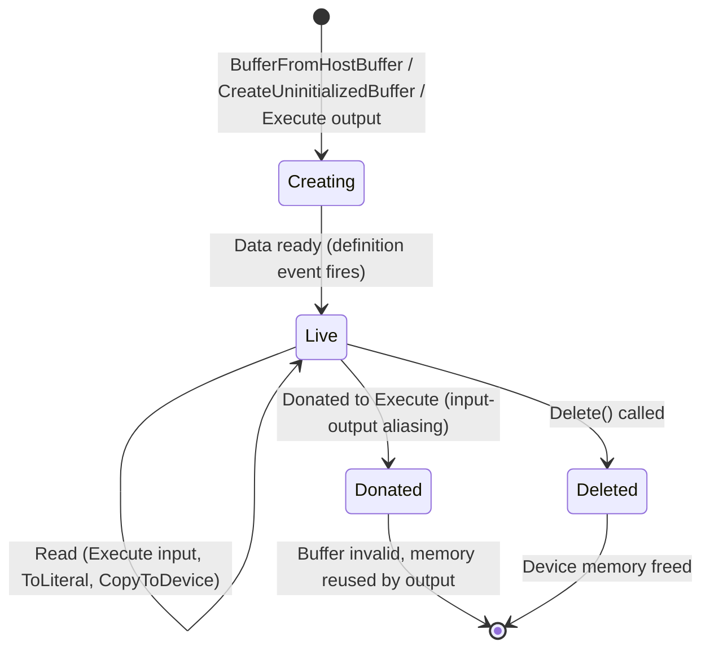
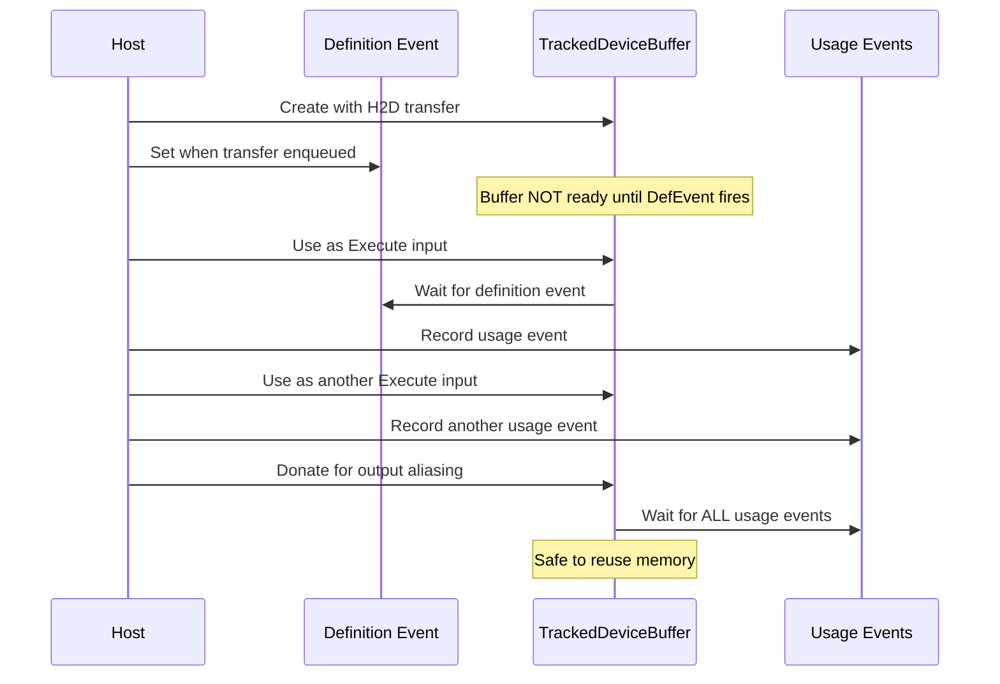
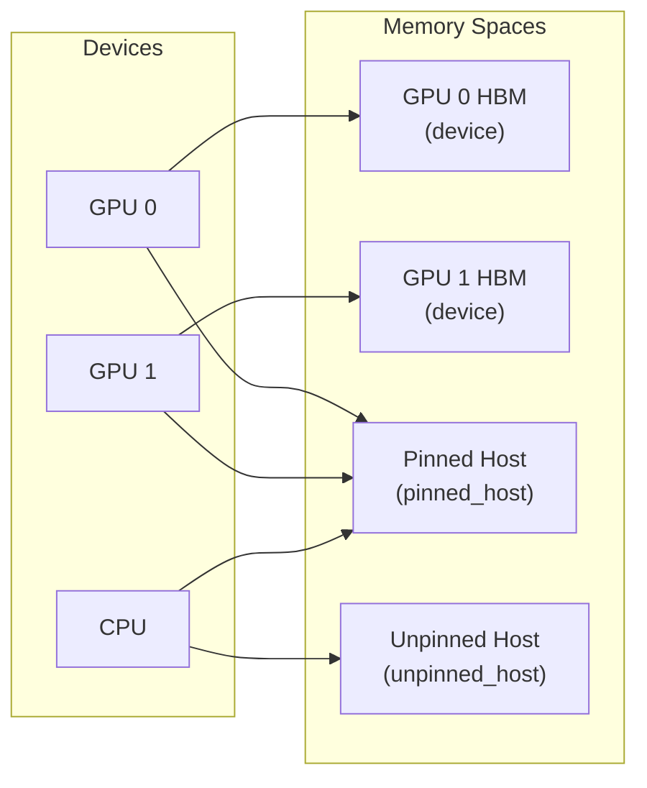
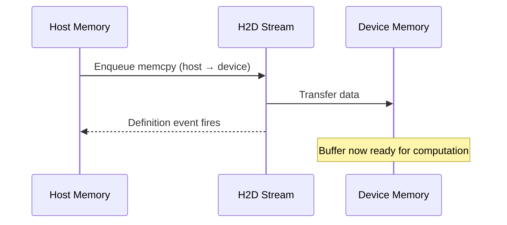

# PJRT Buffer Management

> **Prerequisites:** Read the [Architecture Deep Dive](architecture.md) for the
> layering model, and the
> [C++ API Overview](cpp_api_overview.md#pjrtbuffer) for `PjRtBuffer` and
> `PjRtMemorySpace` class summaries.

This document covers how PJRT manages device memory: buffer creation, ownership,
event-driven synchronization, memory allocation models, and data transfers
between host and device.

## Table of Contents

- [Buffer Lifecycle](#buffer-lifecycle)
- [Memory Allocation Models](#memory-allocation-models)
- [Tracked Device Buffers and Event Synchronization](#tracked-device-buffers-and-event-synchronization)
- [Memory Spaces](#memory-spaces)
- [Transfer Operations](#transfer-operations)
- [External References and DMA](#external-references-and-dma)
- [Further Resources](#further-resources)

---

## Buffer Lifecycle

A `PjRtBuffer` represents a contiguous allocation of device memory holding
tensor data. Buffers progress through a well-defined lifecycle:



### Creation Methods

| Method | Description | Typical Use |
|--------|-------------|-------------|
| `BufferFromHostBuffer` | Copy host data to device | Loading model weights, inputs |
| `CreateViewOfDeviceBuffer` | Wrap existing device pointer | Interop with other GPU libraries |
| `CreateUninitializedBuffer` | Allocate without data | Pre-allocation for later fill |
| Execute output | Created by `Execute` as results | Computation results |

### Host Buffer Semantics

When creating a buffer from host data, the `HostBufferSemantics` enum controls
when the host data pointer can be freed:

| Semantic | Host pointer lifetime | Copy behavior |
|----------|----------------------|---------------|
| `kImmutableOnlyDuringCall` | Valid only during `BufferFromHostBuffer` call | Framework may copy immediately or defer |
| `kImmutableUntilTransferCompletes` | Valid until `on_done_with_host_buffer` callback | Framework may use host pointer directly for DMA |
| `kImmutableZeroCopy` | Valid for buffer lifetime | No copy; buffer reads directly from host memory |
| `kMutableZeroCopy` | Valid and mutable for buffer lifetime | No copy; changes to host memory visible to device |

### Deletion

- `PjRtBuffer::Delete()` releases **device memory** immediately (or as soon as
  in-flight operations complete)
- The C++ `PjRtBuffer` object itself is freed when its last reference drops
- At the C API level, `PJRT_Buffer_Delete` releases device memory while
  `PJRT_Buffer_Destroy` frees the C wrapper struct

> **Source:** [`xla/pjrt/pjrt_client.h`](../../xla/pjrt/pjrt_client.h) -- `PjRtClient::BufferFromHostBuffer`, `HostBufferSemantics`

---

## Memory Allocation Models

Different backends use different strategies for coordinating buffer allocation
with device execution. The `AllocationModel` enum (defined in
`LocalDeviceState`) determines the rules:

```mermaid
flowchart TD
    subgraph "kSynchronous (CPU)"
        S1["Allocate buffer"] --> S2["Buffer immediately usable"]
        S2 --> S3["Use in computation"]
        S3 --> S4["All streams done → Free"]
    end

    subgraph "kComputeSynchronized (GPU)"
        C1["Allocate buffer"] --> C2["Buffer usable after prior<br/>compute stream work finishes"]
        C2 --> C3["Use in computation"]
        C3 --> C4["Complex freeing:<br/>depends on compute +<br/>non-compute stream usage"]
    end

    subgraph "kAsynchronous (TPU)"
        A1["Allocate buffer"] --> A2["Buffer immediately usable"]
        A2 --> A3["Use in computation"]
        A3 --> A4["Free after last op enqueued<br/>(runtime tracks internally)"]
    end
```



### kSynchronous (CPU)

- Buffer is usable **immediately** after allocation
- The client must keep the buffer alive until all device operations using it
  complete
- Simplest model -- no stream-based coordination needed
- Used by: `PjRtCpuClient`

### kComputeSynchronized (GPU)

- Buffer is usable only after the **compute stream** finishes any prior work
  that could conflict
- Uses **sync points** (`GetNextComputeStreamSyncPoint()`) for cheap event IDs
  instead of creating a GPU event for every allocation
- GPU events are created lazily via `GetEventForComputeStreamSyncPoint()` only
  when actually needed for synchronization
- Freeing is complex: must track usage across compute streams *and*
  non-compute streams (transfer streams, callback streams)
- Used by: `StreamExecutorGpuClient`

### kAsynchronous (TPU)

- Buffer is usable **immediately** after allocation
- The runtime internally tracks when buffers can be freed (after the last
  operation using them has been enqueued)
- Exception: device-to-device transfers across hosts need explicit keepalive
- Most aggressive model -- minimal host-side synchronization
- Used by: TPU backend

> **Source:** [`xla/pjrt/local_device_state.h`](../../xla/pjrt/local_device_state.h) -- `LocalDeviceState::AllocationModel` enum (`kSynchronous`, `kComputeSynchronized`, `kAsynchronous`)

---

## Tracked Device Buffers and Event Synchronization

PJRT uses **event tracking** to manage buffer dependencies without blocking the
host. Each buffer tracks two kinds of events:

### Definition Events and Usage Events



- **Definition events** (1-2 per buffer): Signal when the buffer's data is
  ready. Must complete before the buffer can be read. Typically set when an
  H2D transfer or computation output is enqueued.

- **Usage events** (0-N per buffer): Signal that a read operation has been
  enqueued on the buffer. Must all complete before the buffer can be donated
  or its memory freed.

### ScopedHold

The `ScopedHold` mechanism provides RAII-based buffer access control:

| Hold Type | Purpose | Concurrency |
|-----------|---------|-------------|
| `kUsage` | Read-only access | Multiple concurrent holds allowed |
| `kExternalReference` | External framework access | One at a time |
| `kDonation` | Exclusive write (for input-output aliasing) | Exclusive; waits for all usage holds |

```
Hold State Machine:
  Uninitialized → Valid → Moved / Converted / Released / Donated / Error
```

A `kDonation` hold is acquired when a buffer is marked for **donation** during
`Execute`. If successful:
1. `ConfirmDonation()` is called after execution is enqueued
2. The buffer is marked invalid (device memory now belongs to the output)
3. The original buffer can no longer be used

If donation fails or the buffer needs to stay alive, the hold is dropped and the
buffer remains valid.

> **Source:**
> - [`xla/pjrt/abstract_tracked_device_buffer.h`](../../xla/pjrt/abstract_tracked_device_buffer.h) -- `ScopedHold`, hold types
> - [`xla/pjrt/tracked_device_buffer.h`](../../xla/pjrt/tracked_device_buffer.h) -- `TrackedDeviceBuffer`, event tracking
> - [`xla/pjrt/buffer_sequencing_event.h`](../../xla/pjrt/buffer_sequencing_event.h) -- `BufferSequencingEvent`

---

## Memory Spaces

Buffers reside in **memory spaces**, which describe the type and location of
memory:

| Memory Space | Description | Typical Use |
|-------------|-------------|-------------|
| **Device memory** | On-accelerator memory (GPU HBM, TPU HBM) | Default for computation |
| **Pinned host memory** | Host memory pinned for fast DMA transfers | Staging for H2D/D2H |
| **Unpinned host memory** | Regular host memory | CPU computation, host offloading |

The relationship between devices and memory spaces is **many-to-many**:
- A device can access multiple memory spaces (e.g., GPU HBM + pinned host)
- A memory space can be accessible from multiple devices (e.g., shared host memory)



Memory spaces are identified by a **kind string** (e.g., `"device"`,
`"pinned_host"`) and a **numeric kind ID** for efficient comparison.

For more on memory spaces, see the
[C++ API Overview: Memory Spaces](cpp_api_overview.md#pjrtmemoryspace).

> **Source:** [`xla/pjrt/pjrt_client.h`](../../xla/pjrt/pjrt_client.h) -- `PjRtMemorySpace`

---

## Transfer Operations

PJRT supports three directions of data transfer, each with dedicated
infrastructure:

### Host-to-Device (H2D)



- **Primary API:** `BufferFromHostBuffer` (single transfer),
  `AsyncHostToDeviceTransferManager` (streaming/chunked)
- **GPU:** Uses a dedicated `host_to_device_stream` separate from compute
- **CPU:** Direct memory copy (synchronous or async depending on size)
- **Staging:** For GPU, host data may first be copied to pinned memory, then
  DMA'd to device. Transfers > 1GB may skip staging.

### Device-to-Host (D2H)

- **Primary API:** `ToLiteral`, `CopyRawToHost`, `CopyRawToHostFuture`
- **GPU:** Uses round-robin across multiple `device_to_host_stream`s
  (typically 4) to overlap transfers
- Returns a `Future<>` for async completion

### Device-to-Device (D2D)

- **Primary API:** `CopyToDevice`, `CopyToMemory`
- **Same device:** May be a no-op or same-device memcpy
- **Same host, different device:** Peer-to-peer transfer if supported,
  otherwise staged through host
- **Cross-host:** Uses collective communication (NCCL/RCCL) or
  `CrossHostSendBuffers`/`MakeCrossHostReceiveBuffers`
- **GPU:** Uses round-robin across `device_to_device_stream`s

### Stream Assignment (GPU)

The GPU backend uses **dedicated streams** for different transfer types to
enable overlap:

| Stream | Count | Purpose |
|--------|-------|---------|
| `compute_stream` | 1 | Main execution |
| `host_to_device_stream` | 1 | H2D transfers |
| `device_to_host_stream` | 4 (round-robin) | D2H transfers |
| `device_to_device_stream` | 4 (round-robin) | D2D transfers |
| `callback_stream` | 1 | Host callbacks |

> **Source:**
> - [`xla/pjrt/raw_buffer.h`](../../xla/pjrt/raw_buffer.h) -- `CommonPjRtRawBuffer` transfer interface
> - [`xla/pjrt/local_device_state.h`](../../xla/pjrt/local_device_state.h) -- stream management

---

## External References and DMA

### External References

Frameworks sometimes need direct access to device memory pointers (e.g., for
interop with CUDA libraries). PJRT provides:

- `PjRtBuffer::AcquireExternalReference()` → `PjRtBuffer::ExternalReference`
  - Provides a raw device pointer
  - Buffer is kept alive for the lifetime of the reference
  - One external reference at a time (exclusive)

At the C API level:
- `PJRT_Buffer_IncreaseExternalReferenceCount` / `PJRT_Buffer_DecreaseExternalReferenceCount`
  for reference-counted external access
- `PJRT_Buffer_UnsafePointer` for a raw pointer (no lifetime guarantee)
- `PJRT_Buffer_OpaqueDeviceMemoryDataPointer` for an opaque device pointer

### DMA Mapping

For high-performance host-to-device transfers, host memory can be
**DMA-mapped** to enable direct device access:

- `PJRT_Client_DmaMap` -- Map host memory region for device DMA access
- `PJRT_Client_DmaUnmap` -- Unmap previously DMA-mapped memory

DMA mapping is beneficial when the same host memory region is transferred
repeatedly (e.g., streaming input data). The mapping cost is amortized across
multiple transfers.

> **Source:** [`xla/pjrt/c/pjrt_c_api.h`](../../xla/pjrt/c/pjrt_c_api.h) -- DMA and external reference functions

---

## Further Resources

- [Architecture Deep Dive](architecture.md) -- overall PJRT structure
- [C API Reference](c_api_reference.md) -- buffer-related C API functions
- [Execution Pipeline](execution_pipeline.md) -- how buffers are used during execution
- [GPU Backend](backend_gpu.md) -- GPU memory allocators and stream details
- [CPU Backend](backend_cpu.md) -- CPU memory model
- [OpenXLA DevLab playlist](https://www.youtube.com/playlist?list=PLlFotmaRrOzv2OIEpijqiHGmY7rpscFcj)
