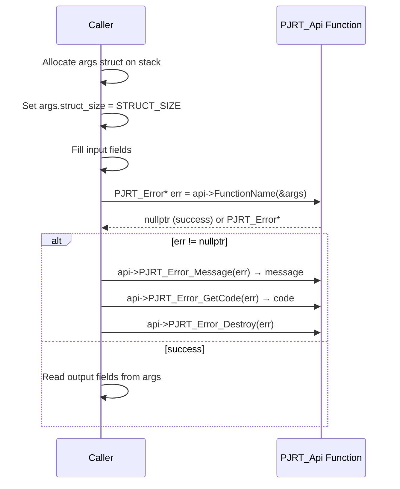

# PJRT C API Quick Reference

> **Prerequisites:** Read the [Architecture Deep Dive](architecture.md) for
> context on the two-layer design and plugin system.

This document is a scannable reference for the PJRT C API. For the authoritative
definition, see
[`xla/pjrt/c/pjrt_c_api.h`](../../xla/pjrt/c/pjrt_c_api.h).
For version history, see the
[CHANGELOG](../../xla/pjrt/c/CHANGELOG.md).

> **Video resource:** The
> [PJRT Plugin Tutorial (OpenXLA 2024 Fall DevLab)](https://www.youtube.com/watch?v=2GlMqaNxP_w)
> walks through implementing C API functions.

## Table of Contents

- [Version Information](#version-information)
- [API Calling Convention](#api-calling-convention)
- [Functions by Operation](#functions-by-operation)
  - [Error Handling](#error-handling)
  - [Plugin Lifecycle](#plugin-lifecycle)
  - [Events](#events)
  - [Client Management](#client-management)
  - [Device and Memory Queries](#device-and-memory-queries)
  - [Compilation](#compilation)
  - [Execution](#execution)
  - [Buffer Operations](#buffer-operations)
  - [Async Host-to-Device Transfers](#async-host-to-device-transfers)
  - [Topology](#topology)
- [Arg Struct Patterns](#arg-struct-patterns)
- [Extension Reference](#extension-reference)

---

## Version Information

```c
#define PJRT_API_MAJOR 0     // ABI-incompatible changes
#define PJRT_API_MINOR 103   // Compatible additions
```

**Compatibility rules:**
- Major mismatch → plugin cannot be loaded
- Framework detects plugin's minor version via `PJRT_Api.pjrt_api_version`
- Each arg struct has `struct_size` to detect field awareness at runtime
- New fields always appended to struct end; never reorder or delete

**Minimum supported minor version:** Check `PJRT_DEFINE_STRUCT_TRAITS` usage
per struct to see which fields exist at which version.

---

## API Calling Convention

Every C API function follows the same pattern:



**Key rules:**
1. Every function returns `PJRT_Error*` -- `nullptr` means success
2. Caller owns (must destroy) the error
3. Args struct is stack-allocated; `struct_size` must be set
4. Output fields are written into the same args struct (marked `// out`)

---

## Functions by Operation

### Error Handling

| Function | Purpose |
|----------|---------|
| `PJRT_Error_Destroy` | Free an error (caller must call after handling) |
| `PJRT_Error_Message` | Get error message string (borrowed, valid until Destroy) |
| `PJRT_Error_GetCode` | Get `PJRT_Error_Code` (maps to `absl::StatusCode`) |
| `PJRT_Error_ForEachPayload` | Iterate over error payloads |

### Plugin Lifecycle

| Function | Purpose |
|----------|---------|
| `PJRT_Plugin_Initialize` | Called once after loading; plugin performs one-time setup |
| `PJRT_Plugin_Attributes` | Return plugin metadata (name-value pairs) |

### Events

Events represent asynchronous completion signals (e.g., buffer ready, execution done).

| Function | Purpose |
|----------|---------|
| `PJRT_Event_Destroy` | Free an event |
| `PJRT_Event_IsReady` | Non-blocking check if event has fired |
| `PJRT_Event_Error` | Get error status (if event completed with error) |
| `PJRT_Event_Await` | Block until event fires |
| `PJRT_Event_OnReady` | Register callback for when event fires |
| `PJRT_Event_Create` | Create a user-controlled event |
| `PJRT_Event_Set` | Signal a user-controlled event |

### Client Management

| Function | Purpose |
|----------|---------|
| `PJRT_Client_Create` | Create a client (the main entry point for plugin usage) |
| `PJRT_Client_Destroy` | Tear down client and release all resources |
| `PJRT_Client_PlatformName` | Get platform identifier (e.g., "cuda", "cpu", "tpu") |
| `PJRT_Client_ProcessIndex` | Get this process's index in multi-host setup |
| `PJRT_Client_PlatformVersion` | Get platform version string (e.g., "cuda 12040") |
| `PJRT_Client_Devices` | List all devices (including non-addressable) |
| `PJRT_Client_AddressableDevices` | List devices this process can issue commands to |
| `PJRT_Client_LookupDevice` | Find device by global ID |
| `PJRT_Client_LookupAddressableDevice` | Find device by local ID |
| `PJRT_Client_AddressableMemories` | List addressable memory spaces |
| `PJRT_Client_DefaultDeviceAssignment` | Get default device assignment for replicas/partitions |
| `PJRT_Client_TopologyDescription` | Get topology (borrowed from client) |
| `PJRT_Client_UpdateGlobalProcessInfo` | Update global process info (distributed) |

### Device and Memory Queries

**Device Description:**

| Function | Purpose |
|----------|---------|
| `PJRT_DeviceDescription_Id` | Global device ID |
| `PJRT_DeviceDescription_ProcessIndex` | Owning process index |
| `PJRT_DeviceDescription_Attributes` | Device attributes (vendor, compute capability, etc.) |
| `PJRT_DeviceDescription_Kind` | Device kind string (e.g., "gpu", "cpu") |
| `PJRT_DeviceDescription_DebugString` | Human-readable debug string |
| `PJRT_DeviceDescription_ToString` | Display string |

**Device:**

| Function | Purpose |
|----------|---------|
| `PJRT_Device_GetDescription` | Get device description |
| `PJRT_Device_IsAddressable` | Can this process issue commands to this device? |
| `PJRT_Device_LocalHardwareId` | Local hardware ID (e.g., GPU ordinal) |
| `PJRT_Device_AddressableMemories` | Memory spaces accessible from this device |
| `PJRT_Device_DefaultMemory` | Default memory space for this device |
| `PJRT_Device_MemoryStats` | Memory usage statistics |
| `PJRT_Device_GetAttributes` | Device attributes |
| `PJRT_Device_PoisonExecution` | Mark device as failed (abort pending work) |
| `PJRT_Device_CreateAsyncTrackingEvent` | Create event for external async tracking |

**Memory:**

| Function | Purpose |
|----------|---------|
| `PJRT_Memory_Id` | Memory space ID |
| `PJRT_Memory_Kind` | Memory kind string (e.g., "device", "pinned_host") |
| `PJRT_Memory_Kind_Id` | Numeric memory kind ID |
| `PJRT_Memory_DebugString` | Human-readable debug string |
| `PJRT_Memory_ToString` | Display string |
| `PJRT_Memory_AddressableByDevices` | Devices that can access this memory |

### Compilation

| Function | Purpose |
|----------|---------|
| `PJRT_Client_Compile` | Compile program → `PJRT_LoadedExecutable` (JIT, tied to client) |
| `PJRT_Compile` | Compile program → `PJRT_Executable` (AOT, standalone, uses topology) |
| `PJRT_Client_Load` | Load a pre-compiled executable into a client |
| `PJRT_Executable_DeserializeAndLoad` | Deserialize bytes and load into client |

**Executable metadata:**

| Function | Purpose |
|----------|---------|
| `PJRT_Executable_Destroy` | Free executable |
| `PJRT_Executable_Name` | Executable name (from HLO entry computation) |
| `PJRT_Executable_NumReplicas` | Number of replicas |
| `PJRT_Executable_NumPartitions` | Number of partitions |
| `PJRT_Executable_NumOutputs` | Number of output values |
| `PJRT_Executable_SizeOfGeneratedCodeInBytes` | Generated code size |
| `PJRT_Executable_GetCostAnalysis` | Performance cost analysis |
| `PJRT_Executable_OutputMemoryKinds` | Output memory kind per output |
| `PJRT_Executable_OutputElementTypes` | Output element type per output |
| `PJRT_Executable_OutputDimensions` | Output dimensions per output |
| `PJRT_Executable_OptimizedProgram` | Get optimized HLO |
| `PJRT_Executable_Serialize` | Serialize to bytes for storage/transfer |
| `PJRT_Executable_Fingerprint` | Content fingerprint for caching |
| `PJRT_Executable_GetCompiledMemoryStats` | Peak memory usage |
| `PJRT_Executable_GetCompileOptions` | Retrieve compile options used |
| `PJRT_Executable_ParameterMemoryKinds` | Parameter memory kind per input |

### Execution

| Function | Purpose |
|----------|---------|
| `PJRT_LoadedExecutable_Execute` | Execute on assigned devices with input buffers |
| `PJRT_LoadedExecutable_Destroy` | Free loaded executable |
| `PJRT_LoadedExecutable_GetExecutable` | Get underlying `PJRT_Executable` |
| `PJRT_LoadedExecutable_AddressableDevices` | Devices this executable is loaded on |
| `PJRT_LoadedExecutable_AddressableDeviceLogicalIds` | Logical device IDs |
| `PJRT_LoadedExecutable_Delete` | Unload from devices (free device resources) |
| `PJRT_LoadedExecutable_IsDeleted` | Check if unloaded |
| `PJRT_LoadedExecutable_Fingerprint` | Fingerprint of loaded executable |
| `PJRT_LoadedExecutable_GetDeviceAssignment` | Device assignment for replicas/partitions |
| `PJRT_ExecuteContext_Create` | Create execution context (scoped state) |
| `PJRT_ExecuteContext_Destroy` | Free execution context |

### Buffer Operations

**Creation:**

| Function | Purpose |
|----------|---------|
| `PJRT_Client_BufferFromHostBuffer` | Create buffer from host data (with transfer semantics) |
| `PJRT_Client_CreateViewOfDeviceBuffer` | Wrap existing device pointer as buffer |
| `PJRT_Client_CreateUninitializedBuffer` | Allocate uninitialized device buffer |
| `PJRT_Client_CreateAliasBuffer` | Create alias (shared backing) buffer |
| `PJRT_Client_FulfillAliasBuffer` | Provide backing for alias buffer |
| `PJRT_Client_CreateErrorBuffer` | Create buffer in error state |

**Queries:**

| Function | Purpose |
|----------|---------|
| `PJRT_Buffer_ElementType` | Data element type |
| `PJRT_Buffer_Dimensions` | Shape dimensions |
| `PJRT_Buffer_UnpaddedDimensions` | Logical dimensions (excluding padding) |
| `PJRT_Buffer_DynamicDimensionIndices` | Which dimensions are dynamic |
| `PJRT_Buffer_GetMemoryLayout` | Memory layout (tiling, minor-to-major) |
| `PJRT_Buffer_OnDeviceSizeInBytes` | Actual device memory usage |
| `PJRT_Buffer_Device` | Which device holds this buffer |
| `PJRT_Buffer_Memory` | Which memory space holds this buffer |
| `PJRT_Buffer_IsOnCpu` | Whether buffer is in host-accessible memory |
| `PJRT_Buffer_IsDeleted` | Whether buffer has been deleted |

**Transfers:**

| Function | Purpose |
|----------|---------|
| `PJRT_Buffer_ToHostBuffer` | Copy device → host (returns event for completion) |
| `PJRT_Buffer_CopyRawToHost` | Raw bytes copy device → host |
| `PJRT_Buffer_CopyRawToHostFuture` | Raw bytes copy with future-based completion |
| `PJRT_Buffer_CopyToDevice` | Copy buffer to another device |
| `PJRT_Buffer_CopyToMemory` | Copy buffer to a different memory space |

**Lifecycle:**

| Function | Purpose |
|----------|---------|
| `PJRT_Buffer_Destroy` | Free the C buffer wrapper |
| `PJRT_Buffer_Delete` | Release device memory (buffer becomes invalid) |
| `PJRT_Buffer_ReadyEvent` | Get event signaling buffer data is ready |
| `PJRT_Buffer_UnsafePointer` | Get raw device pointer (unsafe, no lifetime guarantee) |
| `PJRT_Buffer_OpaqueDeviceMemoryDataPointer` | Get opaque device memory pointer |
| `PJRT_Buffer_IncreaseExternalReferenceCount` | Keep buffer alive for external use |
| `PJRT_Buffer_DecreaseExternalReferenceCount` | Release external reference |
| `PJRT_Buffer_DonateWithControlDependency` | Donate buffer with dependency event |
| `PJRT_Buffer_Bitcast` | Reinterpret buffer with different type/shape |

**DMA:**

| Function | Purpose |
|----------|---------|
| `PJRT_Client_DmaMap` | Map host memory for DMA access |
| `PJRT_Client_DmaUnmap` | Unmap DMA-mapped memory |

### Async Host-to-Device Transfers

For large or streaming transfers:

| Function | Purpose |
|----------|---------|
| `PJRT_Client_CreateBuffersForAsyncHostToDevice` | Create transfer manager + placeholder buffers |
| `PJRT_AsyncHostToDeviceTransferManager_Destroy` | Free transfer manager |
| `PJRT_AsyncHostToDeviceTransferManager_TransferData` | Send a chunk of raw data |
| `PJRT_AsyncHostToDeviceTransferManager_TransferLiteral` | Send an XLA literal |
| `PJRT_AsyncHostToDeviceTransferManager_RetrieveBuffer` | Get buffer (usable once transfer completes) |
| `PJRT_AsyncHostToDeviceTransferManager_Device` | Device receiving the transfer |
| `PJRT_AsyncHostToDeviceTransferManager_BufferCount` | Number of buffers being transferred |
| `PJRT_AsyncHostToDeviceTransferManager_BufferSize` | Size of specific buffer |
| `PJRT_AsyncHostToDeviceTransferManager_SetBufferError` | Signal error for a buffer |
| `PJRT_AsyncHostToDeviceTransferManager_AddMetadata` | Add metadata to transfer |

### Topology

| Function | Purpose |
|----------|---------|
| `PJRT_TopologyDescription_Create` | Create topology description (for AOT compilation) |
| `PJRT_TopologyDescription_Destroy` | Free topology (only if caller-owned) |
| `PJRT_TopologyDescription_PlatformName` | Platform name |
| `PJRT_TopologyDescription_PlatformVersion` | Platform version |
| `PJRT_TopologyDescription_GetDeviceDescriptions` | List of device descriptions in topology |
| `PJRT_TopologyDescription_Serialize` | Serialize topology for storage/transfer |
| `PJRT_TopologyDescription_Deserialize` | Deserialize topology |
| `PJRT_TopologyDescription_Attributes` | Topology attributes |
| `PJRT_TopologyDescription_Fingerprint` | Topology fingerprint for caching |

### Copy-to-Device Stream

| Function | Purpose |
|----------|---------|
| `PJRT_CopyToDeviceStream_Destroy` | Free stream |
| `PJRT_CopyToDeviceStream_AddChunk` | Add a data chunk |
| `PJRT_CopyToDeviceStream_TotalBytes` | Total expected bytes |
| `PJRT_CopyToDeviceStream_GranuleSize` | Minimum chunk size |
| `PJRT_CopyToDeviceStream_CurrentBytes` | Bytes transferred so far |

---

## Arg Struct Patterns

### Initialization

Every arg struct must have `struct_size` set:

```c
PJRT_Client_Compile_Args args;
args.struct_size = PJRT_Client_Compile_Args_STRUCT_SIZE;
args.client = client;
args.program = &program;
args.compile_options = options_data;
args.compile_options_size = options_size;

PJRT_Error* err = api->PJRT_Client_Compile(&args);
if (err != nullptr) {
    // Handle error, then:
    api->PJRT_Error_Destroy(err);
    return;
}
// Success: args.executable is populated
PJRT_LoadedExecutable* executable = args.executable;
```

### Output Fields

Args structs double as return structs. Output fields are marked `// out` in
the header:

```c
struct PJRT_Client_Compile_Args {
  size_t struct_size;
  PJRT_Client* client;              // input
  const PJRT_Program* program;       // input
  const char* compile_options;        // input
  size_t compile_options_size;        // input
  PJRT_LoadedExecutable* executable;  // out
};
```

### String Return Convention

String outputs are returned as `const char* + size_t` pairs. The string is
**borrowed** -- valid only as long as the owning object lives:

```c
PJRT_Client_PlatformName_Args args;
args.struct_size = PJRT_Client_PlatformName_Args_STRUCT_SIZE;
args.client = client;
api->PJRT_Client_PlatformName(&args);
// args.platform_name and args.platform_name_size now valid
// String is borrowed from client -- do not free
```

---

## Extension Reference

| Extension Type | Header File | Purpose | Backends |
|---------------|-------------|---------|----------|
| `Gpu_Custom_Call` | `pjrt_c_api_gpu_extension.h` | Register custom GPU kernels | GPU |
| `Profiler` | `pjrt_c_api_profiler_extension.h` | Profiling hooks | All |
| `Custom_Partitioner` | `pjrt_c_api_custom_partitioner_extension.h` | Custom SPMD partitioning | All |
| `Stream` | `pjrt_c_api_stream_extension.h` | Access CUDA/HIP streams | GPU |
| `Layouts` | `pjrt_c_api_layouts_extension.h` | Custom layout support | All |
| `FFI` | `pjrt_c_api_ffi_extension.h` | Foreign Function Interface | All |
| `MemoryDescriptions` | `pjrt_c_api_memory_descriptions_extension.h` | Describe available memory types | All |
| `Triton` | `pjrt_c_api_triton_extension.h` | Triton kernel integration | GPU |
| `RawBuffer` | `pjrt_c_api_raw_buffer_extension.h` | Raw buffer access | All |
| `PhaseCompile` | `pjrt_c_api_phase_compile_extension.h` | Multi-phase compilation | All |
| `CrossHostTransfers` | `pjrt_c_api_cross_host_transfers_extension.h` | Cross-host buffer transfers | GPU, TPU |
| `ExecutableMetadata` | `pjrt_c_api_executable_metadata_extension.h` | Extra executable metadata | All |
| `Callback` | `pjrt_c_api_callback_extension.h` | Host callback support | All |
| `HostAllocator` | `pjrt_c_api_host_allocator_extension.h` | Custom host allocation | All |
| `TpuTopology` | `pjrt_c_api_tpu_topology_extension.h` | TPU topology queries | TPU |
| `TpuExecutable` | `pjrt_c_api_tpu_executable_extension.h` | TPU executable metadata | TPU |
| `Shardings` | `pjrt_c_api_shardings_extension.h` | Sharding specifications | All |
| `AbiVersion` | (inline in main header) | ABI version negotiation | All |
| `Collectives` | `pjrt_c_api_collectives_extension.h` | Collective operations | All |
| `MultiSlice` | `pjrt_c_api_multi_slice_extension.h` | Multi-slice/DCN config | GPU, TPU |

All extension headers are in
[`xla/pjrt/c/`](../../xla/pjrt/c).

To find an extension at runtime:

```c
PJRT_Extension_Base* ext = api->extension_start;
while (ext != nullptr) {
    if (ext->type == PJRT_Extension_Type_Stream) {
        PJRT_Stream_Extension* stream_ext = (PJRT_Stream_Extension*)ext;
        // Use stream_ext->functions...
        break;
    }
    ext = ext->next;
}
```

---

## Further Resources

- [Architecture Deep Dive](architecture.md) -- how the layers fit together
- [PJRT C API header](../../xla/pjrt/c/pjrt_c_api.h) -- authoritative source
- [CHANGELOG](../../xla/pjrt/c/CHANGELOG.md) -- version history
- [Integration Guide](pjrt_integration.md) -- how to implement a plugin
- [OpenXLA DevLab playlist](https://www.youtube.com/playlist?list=PLlFotmaRrOzv2OIEpijqiHGmY7rpscFcj)
