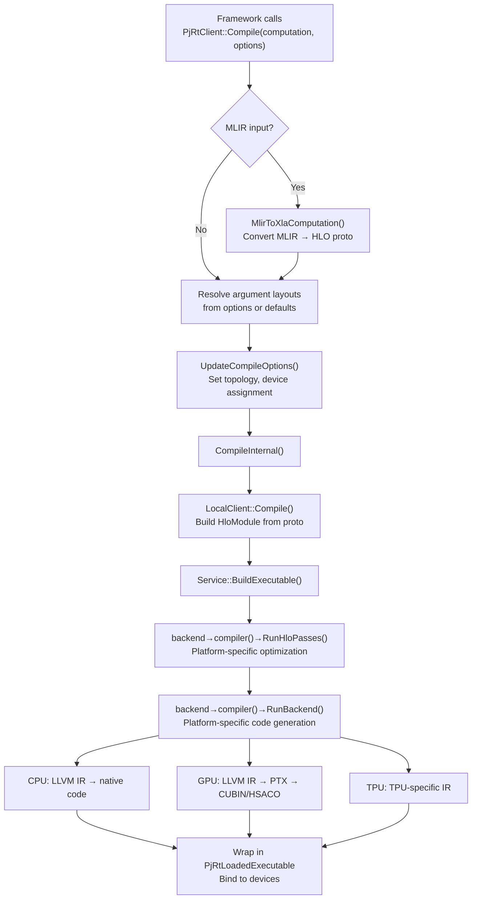
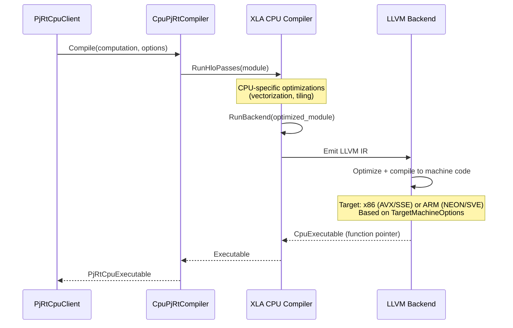
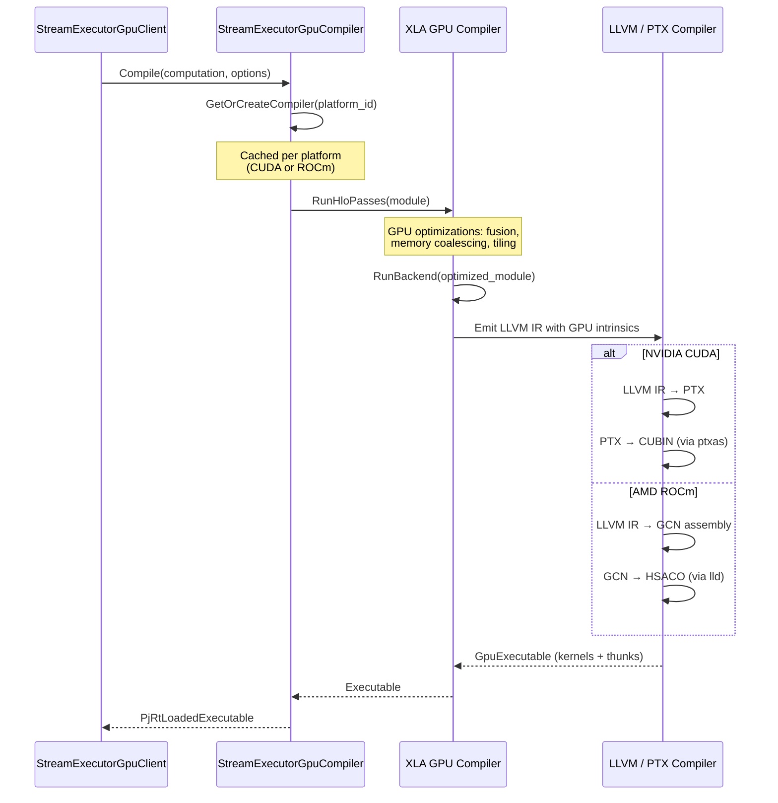
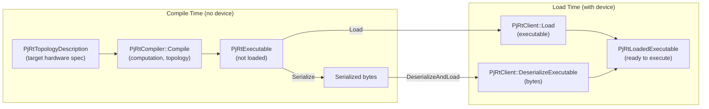

# PJRT Compilation Pipeline

> **Prerequisites:** Read the [Architecture Deep Dive](architecture.md) for the
> class hierarchy, and the
> [C++ API Overview](cpp_api_overview.md#pjrtcompiler) for `PjRtCompiler` and
> `PjRtExecutable` class summaries.

This document traces how ML programs (HLO or StableHLO) are compiled into
device-executable code through PJRT, covering both JIT and AOT paths.

> **Video resource:** [XLA Overview](https://www.youtube.com/watch?v=kAOanJczHA0)
> covers the XLA compilation pipeline at a high level.
> [Using XLA from TF](https://www.youtube.com/watch?v=cPAD9vLKE0c) shows
> compilation in action.

## Table of Contents

- [Overview](#overview)
- [CompileOptions](#compileoptions)
- [Compilation Flow](#compilation-flow)
- [CPU Compilation](#cpu-compilation)
- [GPU Compilation](#gpu-compilation)
- [TPU Compilation](#tpu-compilation)
- [AOT Compilation and Serialization](#aot-compilation-and-serialization)
- [C API Compilation Path](#c-api-compilation-path)
- [Further Resources](#further-resources)

---

## Overview

PJRT accepts programs in two formats:
- **XlaComputation** -- HLO protocol buffer (the traditional XLA format)
- **MLIR module** -- StableHLO dialect (the modern path, used by JAX)

Both are compiled through the same pipeline, with MLIR converted to HLO early
in the process.

### Entry Points

| Method | Input | Output | Use Case |
|--------|-------|--------|----------|
| `PjRtClient::Compile` | XlaComputation or MLIR | `PjRtLoadedExecutable` | JIT compilation (requires client/device) |
| `PjRtClient::CompileAndLoad` | XlaComputation or MLIR | `PjRtLoadedExecutable` | Same as Compile |
| `PjRtCompiler::Compile` | XlaComputation or MLIR + topology | `PjRtExecutable` | AOT compilation (no device needed) |
| `PjRtClient::Load` | `PjRtExecutable` | `PjRtLoadedExecutable` | Load pre-compiled executable |
| `PjRtClient::DeserializeExecutable` | Serialized bytes | `PjRtLoadedExecutable` | Load from disk/network |

---

## CompileOptions

`CompileOptions` controls compilation behavior:

```cpp
struct CompileOptions {
  // Input shape/layout specifications
  std::optional<std::vector<Shape>> argument_layouts;
  bool parameter_is_tupled_arguments = false;

  // Core build options
  ExecutableBuildOptions executable_build_options;

  // Portability
  bool compile_portable_executable = false;  // Device-agnostic output

  // GPU-specific
  std::optional<GpuTargetConfigProto> gpu_target_config;

  // Environment variable overrides
  std::vector<OptionOverride> env_option_overrides;
};
```

`ExecutableBuildOptions` contains:
- `num_replicas` / `num_partitions` -- SPMD configuration
- `device_assignment` -- mapping of replicas/partitions to devices
- `result_layout` -- desired output layout
- `debug_options` -- HLO dump flags, pass control, etc.

> **Source:** [`xla/pjrt/pjrt_executable.h`](../../xla/pjrt/pjrt_executable.h) -- `CompileOptions` struct

---

## Compilation Flow

The full compilation pipeline from PJRT API call to executable:



### Key Pipeline Stages

**Stage 1: Input Processing**
- MLIR → HLO conversion if needed
- Argument layout resolution (from options or platform defaults)
- Option validation and topology setup

**Stage 2: HLO Optimization (`RunHloPasses`)**

Each backend registers its own optimization pipeline. Common passes include:
- Layout assignment (choose memory layouts for efficiency)
- Algebraic simplification
- Constant folding and dead code elimination
- Operation fusion (combine multiple ops into one kernel)
- Buffer assignment (determine memory allocation plan)
- Platform-specific rewrites

**Stage 3: Code Generation (`RunBackend`)**

Platform-specific compilation:
- **CPU:** HLO → LLVM IR → native machine code (via LLVM)
- **GPU:** HLO → LLVM IR → PTX (NVIDIA) / GCN IR (AMD) → CUBIN / HSACO
- **TPU:** HLO → TPU-specific representation (opaque)

**Stage 4: Wrapping**
- Result wrapped in `PjRtLoadedExecutable`
- Bound to specific devices
- Ready for execution

> **Source:**
> - [`xla/pjrt/pjrt_stream_executor_client.h`](../../xla/pjrt/pjrt_stream_executor_client.h) -- `PjRtStreamExecutorClient::Compile`
> - [`xla/service/service.cc`](../../xla/service/service.cc) -- `Service::BuildExecutable`
> - [`xla/service/compiler.h`](../../xla/service/compiler.h) -- `Compiler` interface

---

## CPU Compilation



**CPU-specific details:**
- Uses LLVM for code generation targeting the host architecture
- `TargetMachineOptions` configures: LLVM triple (e.g., `x86_64-unknown-linux-gnu`,
  `aarch64-unknown-linux-gnu`), CPU model, feature flags (AVX2, AVX512, NEON, SVE)
- CPU features are auto-detected at runtime via `DetectMachineAttributes()`
- The compiled executable is a **directly callable function pointer** -- no
  GPU-style kernel launch

> **Source:**
> - [`xla/pjrt/cpu/cpu_pjrt_compiler.h`](../../xla/pjrt/cpu/cpu_pjrt_compiler.h) -- `CpuPjRtCompiler`
> - [`xla/backends/cpu/target_machine_options.h`](../../xla/backends/cpu/target_machine_options.h) -- LLVM target config

---

## GPU Compilation



**GPU compilation modes:**

| Mode | Client | Target Config | Description |
|------|--------|---------------|-------------|
| **JIT** | Present | From device | Standard: compile for the attached GPU |
| **Cross-compile** | Present | From options | Compile for a different GPU than attached |
| **Deviceless** | Absent | From options | AOT compilation without any GPU present |

The GPU compiler uses a **thunk-based execution model**: each HLO operation
compiles to one or more "thunks" (kernel launches, memcpys, collective ops)
that are dispatched sequentially on the compute stream.

> **Source:**
> - [`xla/pjrt/gpu/se_gpu_pjrt_compiler.h`](../../xla/pjrt/gpu/se_gpu_pjrt_compiler.h) -- `StreamExecutorGpuCompiler`
> - [`xla/pjrt/gpu/se_gpu_pjrt_compiler.cc`](../../xla/pjrt/gpu/se_gpu_pjrt_compiler.cc)

---

## TPU Compilation

TPU compilation is entirely behind the C API boundary. The XLA repository
contains only the plugin wrapper:

```
GetXlaPjrtTpuClient()
  → GetCApiClient("tpu")
    → PJRT_Client_Compile (C API call)
      → TPU plugin performs compilation internally (opaque)
```

The TPU compiler's internals (HLO passes, code generation) are not visible in
the open-source XLA repository.

> **Source:** [`xla/pjrt/plugin/xla_tpu/xla_tpu_pjrt_client.h`](../../xla/pjrt/plugin/xla_tpu/xla_tpu_pjrt_client.h)

---

## AOT Compilation and Serialization

AOT (Ahead-of-Time) compilation allows compiling **without a device present**,
using a `PjRtTopologyDescription` to describe the target hardware.

### AOT Compilation Flow



### Compiler Registry

PJRT maintains a global compiler registry (`PjRtCompilerRegistry::Global()`)
mapping platform names to compilers:

```cpp
// Registration (typically at static initialization)
PjRtRegisterCompiler("cuda", std::make_unique<StreamExecutorGpuCompiler>());
PjRtRegisterCompiler("cpu", std::make_unique<CpuPjRtCompiler>());

// Lookup
auto compiler = GetPjRtCompiler("cuda");
auto executable = compiler->Compile(options, computation, topology);
```

### Serialization

Executables can be serialized for storage or transfer:

```cpp
// Serialize
auto serialized = executable->Serialize();  // Returns string of bytes

// Deserialize and load
auto loaded = client->DeserializeExecutable(serialized, options);
```

The serialized format includes:
- Compiled code (CUBIN, native object code, etc.)
- Buffer allocation plan
- HLO metadata
- CompileOptions used

For large executables (>2GB), a split-proto format is used.

> **Source:**
> - [`xla/pjrt/pjrt_compiler.h`](../../xla/pjrt/pjrt_compiler.h) -- `PjRtCompiler`, `PjRtCompilerRegistry`
> - [`xla/pjrt/pjrt_executable.h`](../../xla/pjrt/pjrt_executable.h) -- `PjRtExecutable::Serialize`

---

## C API Compilation Path

At the C API level, two compilation functions exist:

### JIT Compilation (client-bound)

```c
PJRT_Client_Compile_Args args;
args.struct_size = PJRT_Client_Compile_Args_STRUCT_SIZE;
args.client = client;
args.program = &program;  // PJRT_Program with format + code
args.compile_options = serialized_options;
args.compile_options_size = options_size;

PJRT_Error* err = api->PJRT_Client_Compile(&args);
// args.executable is a PJRT_LoadedExecutable*
```

### AOT Compilation (standalone)

```c
PJRT_Compile_Args args;
args.struct_size = PJRT_Compile_Args_STRUCT_SIZE;
args.topology = topology_desc;
args.program = &program;
args.compile_options = serialized_options;
args.compile_options_size = options_size;
args.client = nullptr;  // Optional, for performance hints

PJRT_Error* err = api->PJRT_Compile(&args);
// args.executable is a PJRT_Executable* (not loaded)
```

The AOT-compiled `PJRT_Executable` can later be loaded via
`PJRT_Executable_DeserializeAndLoad` or `PJRT_Client_Load`.

> **Source:** [`xla/pjrt/c/pjrt_c_api.h`](../../xla/pjrt/c/pjrt_c_api.h) -- `PJRT_Client_Compile_Args`, `PJRT_Compile_Args`

---

## Further Resources

- [Architecture Deep Dive](architecture.md) -- class hierarchy and plugin system
- [C API Reference](c_api_reference.md) -- compilation-related C API functions
- [Execution Pipeline](execution_pipeline.md) -- what happens after compilation
- [Buffer Management](buffer_management.md) -- how compiled executables allocate memory
- Backend specifics: [GPU](backend_gpu.md) | [CPU](backend_cpu.md) | [TPU](backend_tpu.md)
- [XLA Overview (video)](https://www.youtube.com/watch?v=kAOanJczHA0)
- [OpenXLA DevLab playlist](https://www.youtube.com/playlist?list=PLlFotmaRrOzv2OIEpijqiHGmY7rpscFcj)
