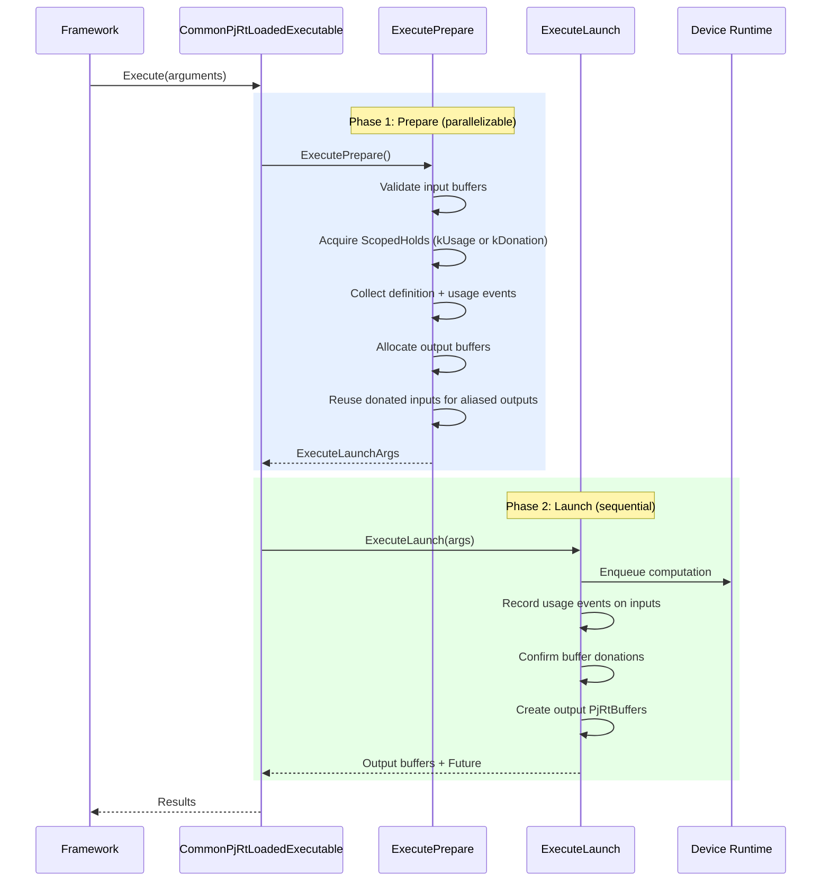
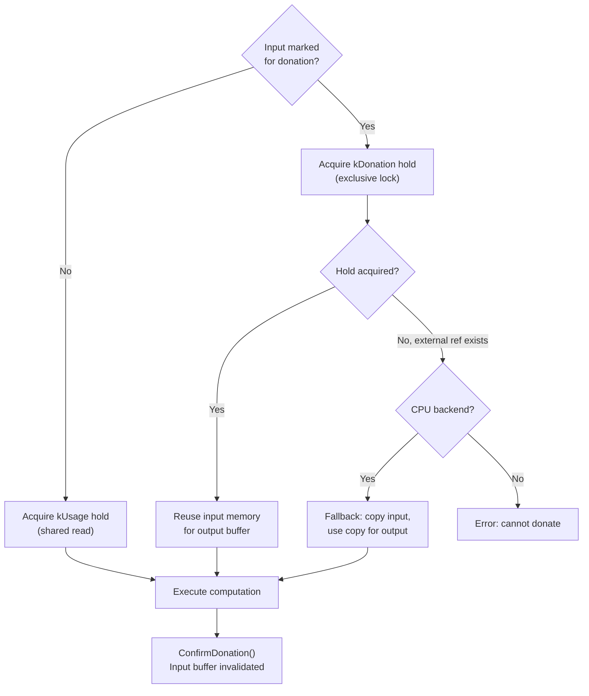
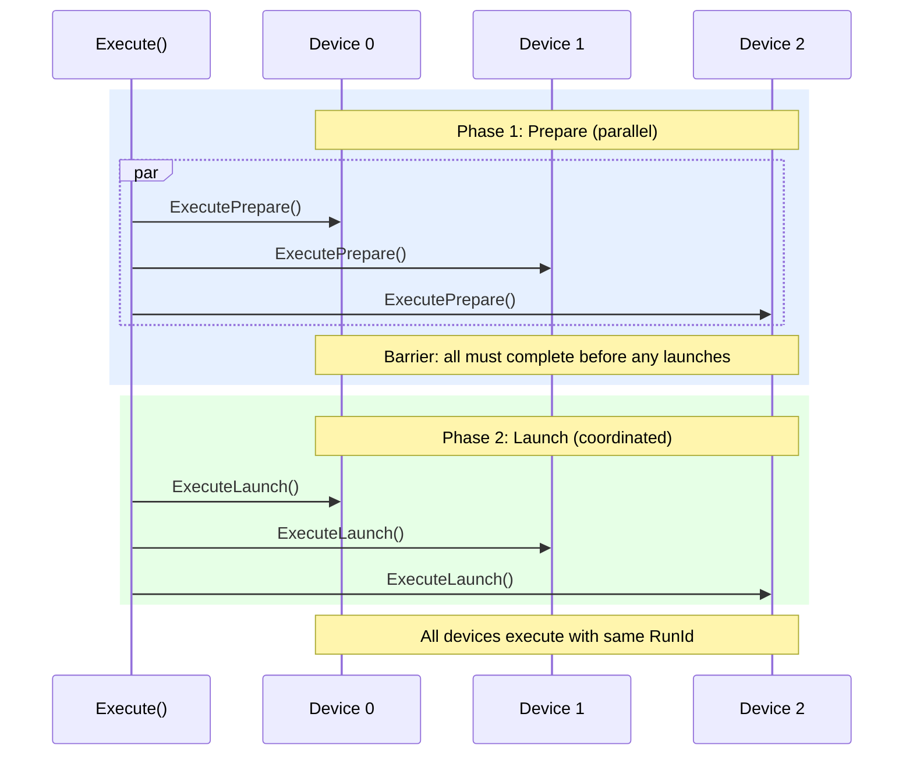
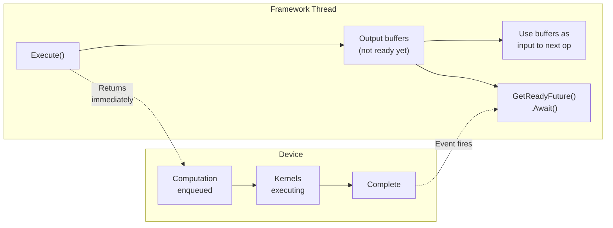

# PJRT Execution Pipeline

> **Prerequisites:** Read the [Compilation Pipeline](compilation_pipeline.md)
> for how executables are produced, and
> [Buffer Management](buffer_management.md) for buffer lifecycle and event
> tracking.

This document covers how PJRT executes compiled programs: the execute entry
points, the two-phase execution model, buffer donation, multi-device
coordination, and async completion.

## Table of Contents

- [Execute Entry Points](#execute-entry-points)
- [Two-Phase Execution Model](#two-phase-execution-model)
- [Buffer Donation and Input-Output Aliasing](#buffer-donation-and-input-output-aliasing)
- [Multi-Device Execution](#multi-device-execution)
- [Async Execution and Futures](#async-execution-and-futures)
- [C API Execution](#c-api-execution)
- [Further Resources](#further-resources)

---

## Execute Entry Points

`PjRtLoadedExecutable` provides three execution methods:

| Method | Devices | Use Case |
|--------|---------|----------|
| `Execute` | All addressable devices | SPMD: run all replicas/partitions |
| `ExecuteSharded` | Single specified device | Run one replica from a multi-replica executable |
| `ExecutePortable` | Single specified device | Run a portable executable (1 replica, 1 partition) on any device |

```cpp
// Execute on all devices (SPMD)
auto results = executable->Execute(
    argument_handles,  // [num_devices][num_args]
    options,
    returned_futures);  // optional async completion

// Execute on one device
auto result = executable->ExecutePortable(
    arguments,  // [num_args]
    device,
    options,
    returned_future);
```

### ExecuteOptions

Key options controlling execution:

| Option | Purpose |
|--------|---------|
| `arguments_are_tupled` | Arguments are a single tuple buffer |
| `untuple_result` | Unpack tuple output into individual buffers |
| `execution_mode` | `kDefault`, `kSynchronous`, `kAsynchronous` |
| `multi_slice_config` | Multi-host configuration |
| `send_callbacks` / `recv_callbacks` | Host callback functions |
| `non_donatable_input_indices` | Inputs that must NOT be donated |
| `context` | Execution context for scoped state |

---

## Two-Phase Execution Model

For the `CommonPjRtClient`-based backends (CPU and GPU StreamExecutor), execution
is split into two phases to enable safe multi-device coordination:



### Phase 1: ExecutePrepare

This phase is **safe to retry on OOM** -- no device work has been enqueued yet.

1. **Input validation** -- Check buffers are on the correct device, shapes match
2. **Hold acquisition** -- Get `kUsage` or `kDonation` holds on input buffers
3. **Event collection** -- Gather definition events (for data deps) and usage
   events (for donation ordering)
4. **Output allocation** -- Allocate output buffers, reusing donated inputs
   where input-output aliasing is specified
5. **OOM retry** -- If allocation fails with `ResourceExhausted`, call OOM
   handlers and retry (`ExecutePrepareWithOomRetries`)

### Phase 2: ExecuteLaunch

This phase **cannot fail** under normal conditions (all validation done in Phase 1).

1. **Enqueue computation** -- Submit work to the device runtime
2. **Update input events** -- Convert usage holds to usage events (kUsage) or
   confirm donations (kDonation)
3. **Create output buffers** -- Wrap allocated memory in `PjRtBuffer` with the
   `primary_execute_event` as definition event
4. **Return** -- Output buffers + optional completion future

> **Source:** [`xla/pjrt/common_pjrt_client.cc`](../../xla/pjrt/common_pjrt_client.cc) -- `CommonPjRtLoadedExecutable::ExecutePrepare` through `CommonPjRtLoadedExecutable::Execute`

---

## Buffer Donation and Input-Output Aliasing

When the XLA compiler determines that an input buffer can be **reused** for an
output (input-output aliasing), PJRT can **donate** the input buffer to avoid
an extra allocation:



### Donation Rules

- An input can only be donated if it has **no other readers** (no external
  references, no pending usage holds)
- The `kDonation` hold is **exclusive** -- it waits for all usage events to
  complete
- After `ConfirmDonation()`, the original input buffer is **permanently
  invalid** -- its device memory now belongs to the output
- CPU backend allows **fallback**: if donation fails, copy the input and donate
  the copy instead
- `non_donatable_input_indices` in `ExecuteOptions` prevents specific inputs
  from being donated

### Why Donation Matters

Donation avoids allocating a separate output buffer when the input won't be
needed after execution. For in-place operations (e.g., optimizer state updates),
this can halve peak memory usage.

> **Source:** [`xla/pjrt/common_pjrt_client.cc`](../../xla/pjrt/common_pjrt_client.cc) -- donation handling within `CommonPjRtLoadedExecutable::ExecutePrepare`

---

## Multi-Device Execution

When `Execute` is called with a multi-device executable, all addressable devices
execute **simultaneously** using gang scheduling:



### Gang Scheduling

- **Purpose:** Prevent deadlocks in collective operations (all-reduce, all-gather)
  which require all participants to be ready
- **Mechanism:** The `gang_scheduler()` mutex ensures that all `LaunchOnDevice`
  calls for a single `Execute` are scheduled atomically
- Each device's prepare phase runs in a separate thread
- A `preparing` counter + `done_preparing` condition variable creates a barrier
- Only after all devices complete Phase 1 do any proceed to Phase 2
- A shared `RunId` correlates cross-device operations within the same execution

### Failure Handling

- If any device fails during prepare, all devices are notified via the shared
  `failed` counter
- If `abort_collectives_on_failure` is set, remaining devices' collectives are
  aborted

> **Source:** [`xla/pjrt/common_pjrt_client.cc`](../../xla/pjrt/common_pjrt_client.cc) -- multi-device gang scheduling within `CommonPjRtLoadedExecutable::Execute`

---

## Async Execution and Futures

By default, PJRT execution is **asynchronous**: `Execute` returns immediately
with "not yet ready" output buffers.



### How Async Works

1. `Execute()` enqueues work on the device and returns immediately
2. Output buffers are created with a `primary_execute_event` as their
   definition event
3. The framework can:
   - **Chain operations:** Pass not-ready buffers as inputs to the next
     `Execute` -- PJRT will wait on the definition event automatically
   - **Explicit wait:** Call `buffer->GetReadyFuture().Await()` to block
     until data is ready
   - **Callback:** Use `PJRT_Event_OnReady` (C API) to register a callback
4. Optional `returned_futures` parameter provides a `Future<>` per device
   for tracking completion separately from buffer readiness

### Execution Mode Override

`ExecuteOptions::execution_mode` can override the default:
- `kDefault` -- backend decides (usually async)
- `kSynchronous` -- block until execution completes
- `kAsynchronous` -- always async

For more on the future/async model, see the
[C++ API Overview: Futures & Async Computations](cpp_api_overview.md).

> **Source:** [`xla/pjrt/pjrt_client.h`](../../xla/pjrt/pjrt_client.h) -- `PjRtLoadedExecutable::Execute`, `ExecuteOptions`

---

## C API Execution

At the C API level, execution uses `PJRT_LoadedExecutable_Execute`:

```c
PJRT_LoadedExecutable_Execute_Args args;
args.struct_size = PJRT_LoadedExecutable_Execute_Args_STRUCT_SIZE;
args.executable = loaded_executable;
args.options = &execute_options;
args.num_devices = num_devices;
args.num_args = num_args;
args.argument_lists = argument_lists;  // PJRT_Buffer**[num_devices][num_args]

PJRT_Error* err = api->PJRT_LoadedExecutable_Execute(&args);

// Outputs:
// args.output_lists[device][output_idx] → PJRT_Buffer*
// args.device_complete_events[device] → PJRT_Event*
```

### Key Differences from C++ API

- Arguments are passed as a 2D array of `PJRT_Buffer**` (devices × args)
- Outputs are also a 2D array, allocated by the callee
- Completion events are `PJRT_Event*` (use `PJRT_Event_Await` or
  `PJRT_Event_OnReady`)
- `PJRT_ExecuteContext` can be created via `PJRT_ExecuteContext_Create` for
  execution-scoped state

> **Source:** [`xla/pjrt/c/pjrt_c_api.h`](../../xla/pjrt/c/pjrt_c_api.h) -- `PJRT_LoadedExecutable_Execute_Args`

---

## Further Resources

- [Buffer Management](buffer_management.md) -- buffer lifecycle, donation details
- [Compilation Pipeline](compilation_pipeline.md) -- how executables are created
- [Architecture Deep Dive](architecture.md) -- class hierarchy
- [C API Reference](c_api_reference.md) -- execution-related C API functions
- Backend specifics: [GPU](backend_gpu.md) | [CPU](backend_cpu.md) | [TPU](backend_tpu.md)
- [OpenXLA DevLab playlist](https://www.youtube.com/playlist?list=PLlFotmaRrOzv2OIEpijqiHGmY7rpscFcj)
